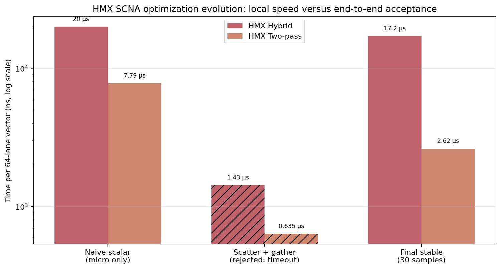
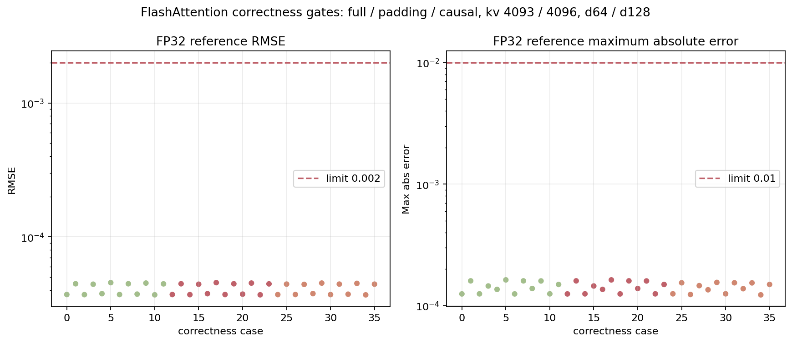
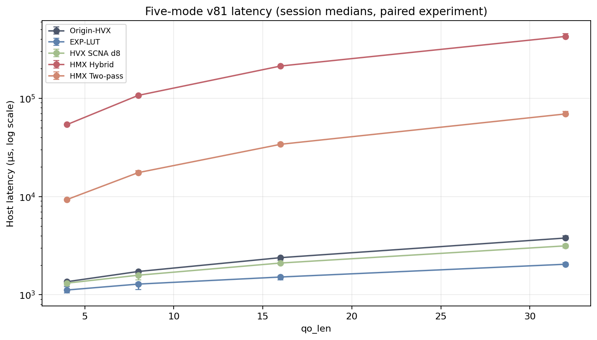
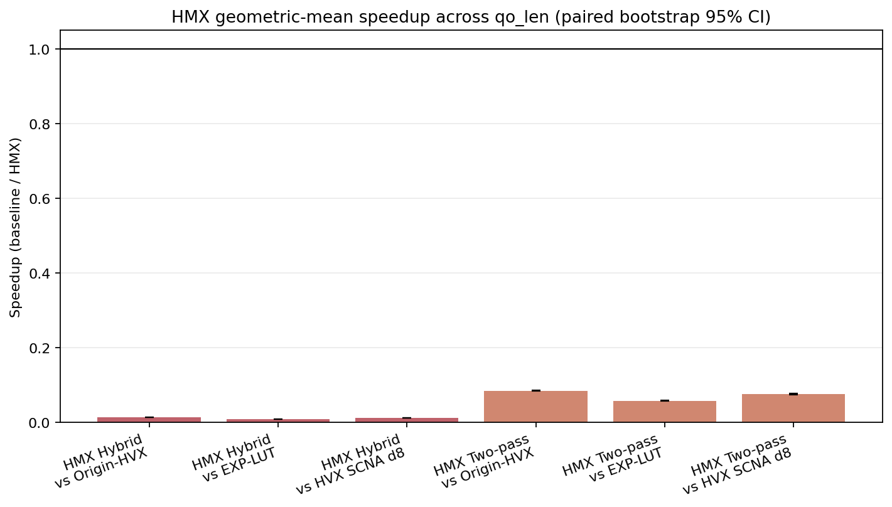
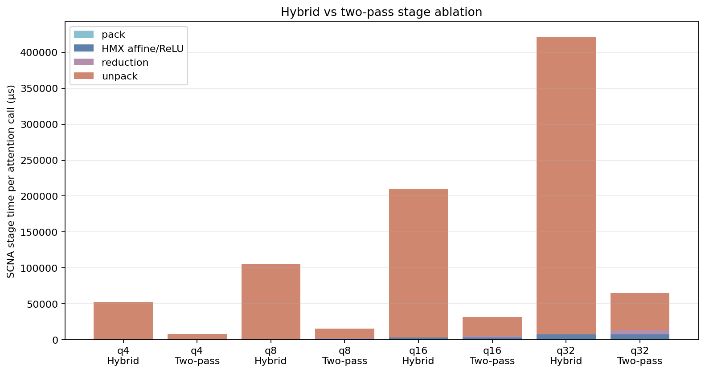
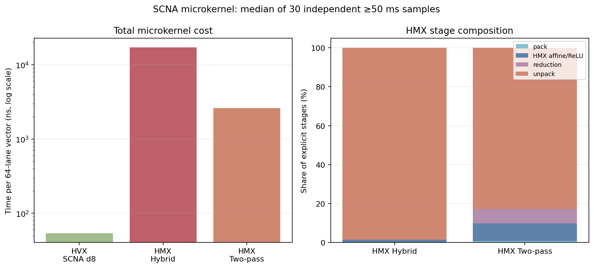

# Hexagon v81 HMX 上的 FP16 d8 SCNA 实验报告

> Run ID：`20260812_scna_hmx_fp16_d8_v81`。正式结论只使用该 run 的原始数据；优化过程另引用版本化开发记录 `docs/HMX_SCNA_OPTIMIZATION_HISTORY.json`。缺失项不会插值。

## 摘要

本次实验在同一个 v81 DSP 二进制中完成五模式比较。HMX 反汇编门禁为 **通过**；FlashAttention 正确性矩阵通过 36/36 项，观测最大 RMSE 为 `4.55581e-05`、最大绝对误差为 `0.000162772`。微核 ≥50 ms 门禁通过 90/90 个有效样本。

相对 HVX SCNA，HMX Hybrid 的跨形状几何平均 speedup 为 `0.013×`（95% CI `0.012–0.013`），结论为 **更慢**。
相对 HVX SCNA，HMX Two-pass 的跨形状几何平均 speedup 为 `0.076×`（95% CI `0.075–0.077`），结论为 **更慢**。

## Setup

- Model：N/A；这是独立 FlashAttention Kernel 实验。
- Dataset：host 端固定种子生成的合成 Q/K/V 与 full、padding、causal mask 张量。
- Hardware：25091RP04C，SoC `SM8750P`，Android 16。
- Toolchain：Hexagon SDK 6.6.0.0、Tools 19.0.07、`-mv81 -mhmx -mhvx -mhvx-length=128B`。
- 主矩阵：`qo_len=[4, 8, 16, 32]`、`kv_len=4096`、heads/KV-heads=`12/2`、`head_dim=128`、full mask、单 worker、KV pipeline off。
- Baseline：Origin-HVX、EXP-LUT、HVX SCNA FP16 direct d8；候选为 HMX Hybrid 与 HMX Two-pass。
- 采样：每 shape 5 个 session，每模式 5 次 warmup + 20 次测量；五模式使用循环 Latin-square 顺序；配对 session 起始最高 CPU 温度跨度上限 3.0°C。
- DSP power：代码请求 `HAP_DCVS_V2_PERFORMANCE_MODE` 和 `TURBO_L3`；Android sysfs 不暴露 CDSP/HMX 实时频率，因此 manifest 明确记录为不可观测。
- DSP binary SHA256：`dbb454034b2251c5e82e39d378005074be56b3af49d68c1615e4b042d3a5f4ff`。
- SCNA 参数 SHA256：`573a381793ab677b3bd72261d5d9c2b27844593c39e8a6b1119c257b039cccad`，与来源文件 SHA256 `573a381793ab677b3bd72261d5d9c2b27844593c39e8a6b1119c257b039cccad` 一致。

## HMX 优化过程：Motivation–Solution–Result

下述前两个 checkpoint 来自开发阶段单批 1,000 次 vector 测量，没有独立样本和置信区间，只用于解释工程决策；最终 checkpoint 来自正式 30 个、每个不少于 50 ms 的独立样本。前期数据不会混入最终配对性能统计。

### 阶段 0：Naive HMX，先建立正确布局

**Motivation。** SCNA 数学形式是 8 个 `ReLU(w_k x+b_k)` 的求和，但 HMX 接收 crouton tile，而 FlashAttention 提供 64-lane HVX vector。首先需要验证 bias 编码、ReLU shape selector、32 spatial × 8 output-channel 布局和第二遍直接重载，性能不是这一阶段的首要目标。

**Solution。** 每次处理 32 个标量，逐元素把输入写入 spatial position 的 channel 0，其余 channel 清零。第一遍 HMX 写出 channel 0–7。Hybrid 逐元素拆出八个 channel 后用七次 HVX `vadd`；two-pass 把第一遍 crouton 直接作为第二遍 activation，用 channel 0–7 的单位权重归约到 output channel 0，再逐元素读回。

**Result。** Hybrid 总耗时 `20.036 µs/vector`，其中 pack `5.504 µs`、unpack `14.270 µs`；二者占总耗时 `98.7%`。Two-pass 总耗时 `7.785 µs/vector`，pack+unpack 占 `94.5%`。数据直接指出，naive 版本的瓶颈是布局搬运，不是 HMX affine/ReLU。

### 阶段 1：向量化 pack/unpack，获得微核局部最优

**Motivation。** Naive Hybrid 和 two-pass 分别有 98.7% 与 94.5% 的时间落在 pack/unpack，因此应先消除逐元素访存。

**Solution。** pack 改用 `Q6_vscatter_QRMVhV`，以预计算 offset 一次写入 32 个 spatial 的 channel 0；unpack 改用 `Q6_vgather_ARMVh` 从 crouton 抽取目标 channel；Hybrid 的 8→1 归约保持七次真实 HVX FP16 `vadd`。

**Result。** Hybrid 从 `20.036` 降到 `1.426 µs/vector`，即 `14.05×`；two-pass 从 `7.785` 降到 `0.635 µs/vector`，即 `12.26×`。Hybrid pack 从 5.504 降至 0.068 µs，unpack 从 14.270 降至 0.546 µs；two-pass pack 从 5.463 降至 0.052 µs，unpack 从 1.890 降至 0.023 µs。

### 阶段 2：端到端门禁否决异步 gather 版本

**Motivation。** 微核计时只证明短循环局部吞吐，不能证明它能在 FlashAttention 的 HMX QK/PV、VTCM 和在线 softmax 环境中稳定运行。因此必须先通过 `qo_len=4, kv_len=4096` 的长序列 warmup，再允许进入正式性能实验。

**Solution。** 把主矩阵长序列 warmup 设为强制门禁，并保留 30 s host timeout、返回码和当时的实现配置；只要门禁失败，就停止该版本的正式性能结论，即使微核数字更低。

**Result。** 两种 HMX 模式均未通过该门禁。Two-pass 在 `30000178` µs 后返回 `ret=-1`；Hybrid 同样达到 30 s timeout。开发实验没有单独隔离出某一条指令级根因，因此这里只能得出“异步 gather 版未通过端到端稳定性门禁”，不能声称发现了 HMX 硬件缺陷。

### 阶段 3：稳定性优先的最终实现

**Motivation。** 验收要求是长序列正确、可重复和可配对测量。一个 0.635 µs 但会在主矩阵超时的微核没有可用性能。

**Solution。** 保留稳定且收益明确的 HVX scatter pack；移除 SCNA 输出侧异步 gather，改为按 crouton 索引确定性解包；在 HMX store 后通过 volatile load 建立完成点，并在 HMX manager setup/reset 显式清零进程内自旋锁。Hybrid 仍做 HVX 七次加法；two-pass 仍让第一遍 crouton 直接重载到第二遍。

**Result。** `kv_len=4096` 初步复测恢复为 `ret=0`：Hybrid `53842 µs`，two-pass `9258 µs`。正式微核中 Hybrid 为 `17.151 µs/vector`，two-pass 为 `2.621 µs/vector`。相对 naive，最终 Hybrid 为 `1.17×`，two-pass 为 `2.97×`；相对未通过门禁的微核局部最优，最终版本分别慢 `12.03×` 和 `4.13×`。这是为稳定性支付的可量化代价。正式配对主矩阵进一步表明，Hybrid 与 two-pass 相对 HVX SCNA 的跨形状 speedup 分别为 `0.0126×`（95% CI `0.0124–0.0127`）和 `0.0762×`（95% CI `0.0749–0.0772`）。因此最终成果是“完成真实 HMX 映射并通过稳定性/正确性验收”，不是“取得性能提升”。

图中阴影柱表示曾达到微核局部最优、但被长序列门禁否决的 scatter+gather 版本。最终 two-pass 比最终 Hybrid 快 `6.54×`。两者 affine/ReLU 中位数接近，分别为 `229.40` 与 `232.55 ns/vector`；差异主要来自 unpack：Hybrid `16832.20 ns`，two-pass `2114.12 ns`，后者减少 `87.4%`。这说明第二遍 HMX 虽增加 reduction，但显著降低了需要恢复的输出通道数。

## 数值门禁

图中包含 full、padding、causal，`kv_len=4093/4096` 与 `head_dim=64/128`。最大 RMSE `4.55581e-05` 低于 `0.002`，最大绝对误差 `0.000162772` 低于 `0.01`；失败 0 项。对需要尾部清零的 case，原始 `FIG8_NUMERIC` 记录用于检查最后 padding/mask lane。

微测试把“SCNA 对真实 exp2 的逼近误差”和“HMX 对 HVX SCNA 的迁移误差”分开记录；前者不作为迁移失败。Hybrid 对 HVX 的最大迁移 RMSE/最大绝对误差为 `0`/`0`；two-pass 为 `2.2216e-05`/`0.000488281`，均按 0.001/0.002 门槛判定。

## 主性能结果

`qo_len=4` 时，最低中位延迟为 EXP-LUT `1118.0 µs`，最高为 HMX Hybrid `53899.0 µs`；误差棒是五个 session 中位数的 bootstrap 95% CI。
`qo_len=8` 时，最低中位延迟为 EXP-LUT `1284.0 µs`，最高为 HMX Hybrid `106836.0 µs`；误差棒是五个 session 中位数的 bootstrap 95% CI。
`qo_len=16` 时，最低中位延迟为 EXP-LUT `1516.0 µs`，最高为 HMX Hybrid `212733.0 µs`；误差棒是五个 session 中位数的 bootstrap 95% CI。
`qo_len=32` 时，最低中位延迟为 EXP-LUT `2045.0 µs`，最高为 HMX Hybrid `425652.0 µs`；误差棒是五个 session 中位数的 bootstrap 95% CI。

HMX Hybrid vs Origin-HVX：`0.014×`，95% CI `0.014–0.014`，因此标记为“更慢”。
HMX Hybrid vs EXP-LUT：`0.010×`，95% CI `0.009–0.010`，因此标记为“更慢”。
HMX Hybrid vs HVX SCNA d8：`0.013×`，95% CI `0.012–0.013`，因此标记为“更慢”。
HMX Two-pass vs Origin-HVX：`0.085×`，95% CI `0.084–0.086`，因此标记为“更慢”。
HMX Two-pass vs EXP-LUT：`0.058×`，95% CI `0.057–0.059`，因此标记为“更慢”。
HMX Two-pass vs HVX SCNA d8：`0.076×`，95% CI `0.075–0.077`，因此标记为“更慢”。

## 阶段消融

最高解包开销出现在 `HMX Hybrid, qo_len=32`：unpack `413836.5 µs`，占四个显式 SCNA 阶段 `98.2%`。该比例直接量化 crouton→HVX 布局恢复成本。

HVX SCNA d8：30 个独立样本的每 64-lane vector 中位总耗时 `53.85 ns`。
HMX Hybrid：30 个独立样本的每 64-lane vector 中位总耗时 `17150.60 ns`。
HMX Two-pass：30 个独立样本的每 64-lane vector 中位总耗时 `2620.80 ns`。
HMX Hybrid 的阶段组成中，unpack 为 `16832.20 ns`/vector，占四个显式阶段 `98.5%`；HMX affine/ReLU 占 `1.3%`。
HMX Two-pass 的阶段组成中，unpack 为 `2114.12 ns`/vector，占四个显式阶段 `82.8%`；HMX affine/ReLU 占 `9.1%`。

## Unexpected Results 与验证计划

1. 布局恢复是首要异常：最差 case 的 unpack 占 `98.2%`，而非 HMX affine/ReLU。验证计划：实现 `vdeal/vshuff` 原生解包并保持同一参数、同一二进制矩阵复测。
2. HMX 低占用：每次只使用 32×1 输入映射到 8 个输出通道，矩阵阵列利用率受 d8 与单输入通道限制。验证计划：批量融合多个 softmax vector 后复测 HMX 阶段与总延迟。
3. Two-pass 增加 intermediate→VTCM→activation 的第二遍往返。验证计划：对比保持第一遍 crouton 驻留、融合第二遍权重加载的版本，并分别报告 reduction 与 unpack。

## Limitations

- 仅验证一款 SM8750P SoC；结论不能外推到其他 HMX 实现或固件。
- 仅覆盖 FP16、d8、exp2 与输入 `[-256, 0]`。
- 仅是 Kernel 级合成数据，无真实模型与数据集。
- 固定无 KV DMA/VTCM pipeline；不能代表 pipeline 打开后的相互作用。
- 未验证模型级精度、困惑度和端到端 token 延迟。
- Android sysfs 无法读取 CDSP/HMX 实时频率；实验只能证实已请求 performance/TURBO_L3，不能证实每个样本的实际 DSP 频率。

## 验收状态

- HMX named-symbol 反汇编证据：通过。
- 全部正确性门禁：通过（36/36）。
- 微核 30×3 且每样本 ≥50 ms：通过。
- 五模式同一二进制：由每个 session 前远端 SHA256 校验，发现不一致时采集器立即拒绝。
- 确定性重建：`tools/analyze_scna_hmx_v81.py` 以固定 seed=8108、10,000 次 bootstrap 从 JSONL 重建 CSV、图和本文。

## 原始证据

- Manifest：`results/20260812_scna_hmx_fp16_d8_v81/manifest.json`
- 原始 JSONL/log：`results/20260812_scna_hmx_fp16_d8_v81/raw/`
- 汇总 CSV/JSON：`results/20260812_scna_hmx_fp16_d8_v81/summary/`
- 优化 checkpoint 数据与证据边界：`docs/HMX_SCNA_OPTIMIZATION_HISTORY.json`
- HMX 反汇编：`results/20260812_scna_hmx_fp16_d8_v81/verification/scna_hmx_symbols.disasm.txt`

## AI 辅助声明

AI 用于代码与实验脚本辅助、机械化数据解析、绘图和报告组织；研究问题、实验设计、设备执行、原始数据验证与全部结论必须由研究者复核。
