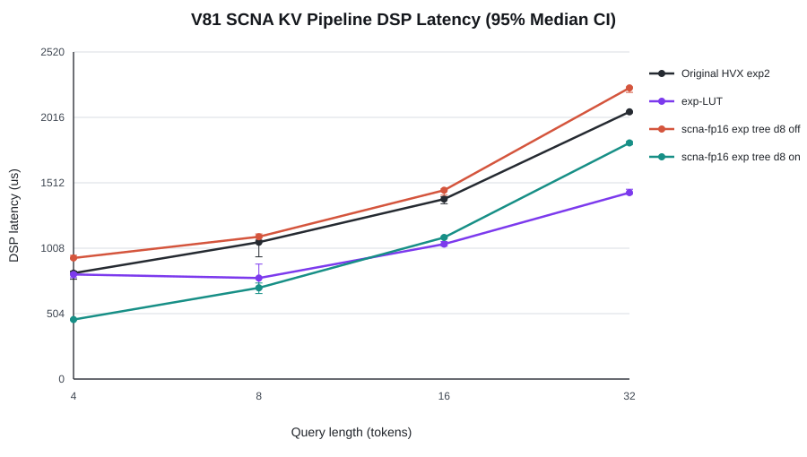
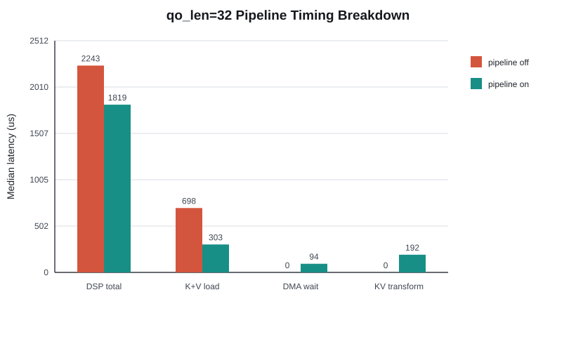

# V81 SCNA KV Pipeline Summary

Generated from adjacent pipeline-off/on runs. Confidence intervals are deterministic bootstrap 95% CIs of the median.

## Selected q32 configuration

- Configuration: scna-fp16 exp tree d8
- DSP median: 2243.0 us off -> 1819.0 us on (1.233x)
- DSP speedup 95% CI: [1.213x, 1.242x]
- Host speedup: 1.224x, 95% CI [1.199x, 1.242x]
- K+V median: 698.0 us off -> 303.0 us on
- Pipeline DMA issue/wait/transform: 9.0 / 93.5 / 192.0 us

## q32 matrix

| Mode | Function | Kernel | Width | Off DSP us | On DSP us | Pipeline speedup [95% CI] | Baseline speedup | On K+V us | DMA wait us |
|---|---|---|---:|---:|---:|---:|---:|---:|---:|
| scna-fp16 | exp | tree | 8 | 2243.0 | 1819.0 | 1.233x [1.213, 1.242] | 1.132x | 303.0 | 93.5 |
