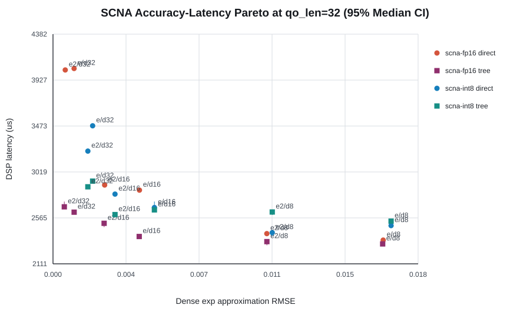

# V81 SCNA FlashAttention Summary

Generated from measured per-iteration host/DSP logs. Confidence intervals are deterministic bootstrap 95% CIs of the median.

## Selected latency series

- Baseline
- scna-fp16 exp tree d8
- scna-int8 exp2 direct d8

## Measurements

| Mode | Function | Kernel | Width | Qo | DSP median us | DSP p95 us | 95% CI us | Host median us | SCNA share | Baseline speedup | Dense RMSE |
|---|---|---|---:|---:|---:|---:|---:|---:|---:|---:|---:|
| baseline | none | none | 0 | 4 | 762.5 | 815.9 | [740.0, 788.0] | 1017.5 | 0.0% | 1.000x | 0 |
| baseline | none | none | 0 | 8 | 935.0 | 981.0 | [905.0, 965.5] | 1224.0 | 0.0% | 1.000x | 0 |
| baseline | none | none | 0 | 16 | 1333.0 | 1355.2 | [1299.5, 1348.0] | 1602.0 | 0.0% | 1.000x | 0 |
| baseline | none | none | 0 | 32 | 1917.0 | 1941.4 | [1909.5, 1929.5] | 2261.0 | 0.0% | 1.000x | 0 |
| scna-fp16 | exp | direct | 8 | 4 | 863.5 | 904.2 | [850.5, 876.0] | 1162.5 | 19.2% | 0.883x | 0.0165054 |
| scna-fp16 | exp | direct | 8 | 8 | 1093.0 | 1102.0 | [1070.5, 1096.5] | 1329.5 | 30.0% | 0.855x | 0.0165054 |
| scna-fp16 | exp | direct | 8 | 16 | 1459.5 | 1511.1 | [1448.0, 1494.0] | 1748.0 | 44.3% | 0.913x | 0.0165054 |
| scna-fp16 | exp | direct | 8 | 32 | 2345.5 | 2355.1 | [2335.5, 2352.5] | 2660.5 | 54.9% | 0.817x | 0.0165054 |
| scna-fp16 | exp | direct | 16 | 4 | 998.5 | 1026.4 | [859.5, 1009.5] | 1280.0 | 23.2% | 0.764x | 0.00432045 |
| scna-fp16 | exp | direct | 16 | 8 | 1226.0 | 1265.2 | [1207.0, 1243.0] | 1542.0 | 36.7% | 0.763x | 0.00432045 |
| scna-fp16 | exp | direct | 16 | 16 | 1704.5 | 1786.1 | [1657.0, 1759.0] | 1994.5 | 52.2% | 0.782x | 0.00432045 |
| scna-fp16 | exp | direct | 16 | 32 | 2839.5 | 2847.1 | [2834.0, 2844.0] | 3167.0 | 62.4% | 0.675x | 0.00432045 |
| scna-fp16 | exp | direct | 32 | 4 | 1126.5 | 1153.0 | [1006.5, 1137.0] | 1383.0 | 33.3% | 0.677x | 0.00105269 |
| scna-fp16 | exp | direct | 32 | 8 | 1564.0 | 1573.0 | [1558.5, 1566.5] | 1867.0 | 46.8% | 0.598x | 0.00105269 |
| scna-fp16 | exp | direct | 32 | 16 | 2380.5 | 2394.0 | [2377.0, 2386.0] | 2654.5 | 60.7% | 0.560x | 0.00105269 |
| scna-fp16 | exp | direct | 32 | 32 | 4042.0 | 4064.3 | [4021.5, 4057.0] | 4365.5 | 71.1% | 0.474x | 0.00105269 |
| scna-fp16 | exp | tree | 8 | 4 | 920.5 | 926.1 | [913.0, 923.5] | 1188.0 | 17.3% | 0.828x | 0.0164817 |
| scna-fp16 | exp | tree | 8 | 8 | 1089.5 | 1131.0 | [1083.0, 1098.0] | 1374.5 | 26.7% | 0.858x | 0.0164817 |
| scna-fp16 | exp | tree | 8 | 16 | 1511.0 | 1523.0 | [1442.5, 1516.5] | 1782.0 | 38.1% | 0.882x | 0.0164817 |
| scna-fp16 | exp | tree | 8 | 32 | 2308.0 | 2318.2 | [2304.0, 2313.0] | 2648.5 | 49.1% | 0.831x | 0.0164817 |
| scna-fp16 | exp | tree | 16 | 4 | 912.0 | 936.0 | [905.5, 916.5] | 1197.0 | 18.4% | 0.836x | 0.00430999 |
| scna-fp16 | exp | tree | 16 | 8 | 1131.5 | 1143.2 | [1120.5, 1139.0] | 1427.0 | 28.5% | 0.826x | 0.00430999 |
| scna-fp16 | exp | tree | 16 | 16 | 1572.0 | 1589.1 | [1528.5, 1583.0] | 1851.0 | 40.3% | 0.848x | 0.00430999 |
| scna-fp16 | exp | tree | 16 | 32 | 2381.0 | 2431.3 | [2376.0, 2387.5] | 2762.5 | 52.2% | 0.805x | 0.00430999 |
| scna-fp16 | exp | tree | 32 | 4 | 784.0 | 788.2 | [781.0, 786.0] | 1029.0 | 26.9% | 0.973x | 0.00105556 |
| scna-fp16 | exp | tree | 32 | 8 | 1129.5 | 1141.2 | [1083.0, 1134.5] | 1407.5 | 36.6% | 0.828x | 0.00105556 |
| scna-fp16 | exp | tree | 32 | 16 | 1728.5 | 1766.3 | [1706.5, 1757.0] | 2020.0 | 47.5% | 0.771x | 0.00105556 |
| scna-fp16 | exp | tree | 32 | 32 | 2621.5 | 2629.0 | [2616.5, 2625.5] | 2965.5 | 61.7% | 0.731x | 0.00105556 |
| scna-fp16 | exp2 | direct | 8 | 4 | 835.5 | 864.4 | [794.5, 849.5] | 1120.5 | 20.0% | 0.913x | 0.0106907 |
| scna-fp16 | exp2 | direct | 8 | 8 | 1076.0 | 1097.1 | [1066.0, 1085.0] | 1348.0 | 30.5% | 0.869x | 0.0106907 |
| scna-fp16 | exp2 | direct | 8 | 16 | 1347.5 | 1359.5 | [1342.5, 1352.5] | 1648.0 | 47.9% | 0.989x | 0.0106907 |
| scna-fp16 | exp2 | direct | 8 | 32 | 2409.5 | 2421.7 | [2391.0, 2417.0] | 2751.5 | 53.5% | 0.796x | 0.0106907 |
| scna-fp16 | exp2 | direct | 16 | 4 | 857.0 | 909.6 | [844.0, 879.0] | 1133.0 | 26.7% | 0.890x | 0.00258165 |
| scna-fp16 | exp2 | direct | 16 | 8 | 1131.5 | 1150.0 | [1118.0, 1142.0] | 1419.5 | 39.8% | 0.826x | 0.00258165 |
| scna-fp16 | exp2 | direct | 16 | 16 | 1722.5 | 1737.0 | [1715.0, 1728.5] | 2018.5 | 51.7% | 0.774x | 0.00258165 |
| scna-fp16 | exp2 | direct | 16 | 32 | 2890.0 | 2900.1 | [2883.0, 2894.0] | 3185.5 | 61.3% | 0.663x | 0.00258165 |
| scna-fp16 | exp2 | direct | 32 | 4 | 1028.0 | 1052.1 | [1023.5, 1038.0] | 1281.0 | 36.1% | 0.742x | 0.000611764 |
| scna-fp16 | exp2 | direct | 32 | 8 | 1467.0 | 1481.2 | [1464.0, 1472.0] | 1720.5 | 49.6% | 0.637x | 0.000611764 |
| scna-fp16 | exp2 | direct | 32 | 16 | 2292.0 | 2309.1 | [2279.5, 2298.5] | 2555.5 | 62.9% | 0.582x | 0.000611764 |
| scna-fp16 | exp2 | direct | 32 | 32 | 4027.5 | 4036.0 | [4023.0, 4033.0] | 4336.0 | 71.3% | 0.476x | 0.000611764 |
| scna-fp16 | exp2 | tree | 8 | 4 | 829.0 | 854.6 | [808.0, 841.5] | 1101.0 | 18.1% | 0.920x | 0.0106913 |
| scna-fp16 | exp2 | tree | 8 | 8 | 890.5 | 893.1 | [889.0, 892.0] | 1118.5 | 32.1% | 1.050x | 0.0106913 |
| scna-fp16 | exp2 | tree | 8 | 16 | 1464.0 | 1504.0 | [1386.5, 1494.5] | 1746.5 | 40.3% | 0.911x | 0.0106913 |
| scna-fp16 | exp2 | tree | 8 | 32 | 2330.5 | 2344.2 | [2294.5, 2336.5] | 2606.5 | 48.5% | 0.823x | 0.0106913 |
| scna-fp16 | exp2 | tree | 16 | 4 | 841.5 | 1016.4 | [830.5, 852.1] | 1090.0 | 19.5% | 0.906x | 0.00255669 |
| scna-fp16 | exp2 | tree | 16 | 8 | 1081.5 | 1237.2 | [1074.5, 1094.0] | 1327.0 | 29.6% | 0.865x | 0.00255669 |
| scna-fp16 | exp2 | tree | 16 | 16 | 1580.0 | 1673.2 | [1572.0, 1666.0] | 1882.5 | 40.3% | 0.844x | 0.00255669 |
| scna-fp16 | exp2 | tree | 16 | 32 | 2511.5 | 2551.4 | [2474.5, 2526.0] | 2823.0 | 49.8% | 0.763x | 0.00255669 |
| scna-fp16 | exp2 | tree | 32 | 4 | 819.0 | 862.0 | [811.0, 824.0] | 1085.0 | 25.8% | 0.931x | 0.000564 |
| scna-fp16 | exp2 | tree | 32 | 8 | 1154.0 | 1279.0 | [1146.0, 1203.5] | 1418.0 | 35.8% | 0.810x | 0.000564 |
| scna-fp16 | exp2 | tree | 32 | 16 | 1817.0 | 1866.0 | [1728.5, 1833.5] | 2098.0 | 45.4% | 0.734x | 0.000564 |
| scna-fp16 | exp2 | tree | 32 | 32 | 2674.5 | 2821.6 | [2667.5, 2726.5] | 3036.0 | 60.5% | 0.717x | 0.000564 |
| scna-int8 | exp | direct | 8 | 4 | 865.5 | 922.4 | [848.5, 914.0] | 1144.0 | 19.5% | 0.881x | 0.0169006 |
| scna-int8 | exp | direct | 8 | 8 | 1151.0 | 1169.1 | [1113.5, 1159.5] | 1457.0 | 29.1% | 0.812x | 0.0169006 |
| scna-int8 | exp | direct | 8 | 16 | 1583.0 | 1589.0 | [1575.0, 1585.0] | 1873.0 | 41.4% | 0.842x | 0.0169006 |
| scna-int8 | exp | direct | 8 | 32 | 2489.0 | 2502.3 | [2483.0, 2496.5] | 2786.5 | 52.5% | 0.770x | 0.0169006 |
| scna-int8 | exp | direct | 16 | 4 | 923.5 | 978.5 | [901.5, 931.5] | 1163.0 | 23.1% | 0.826x | 0.00507027 |
| scna-int8 | exp | direct | 16 | 8 | 1179.0 | 1211.0 | [1162.5, 1184.5] | 1458.0 | 35.5% | 0.793x | 0.00507027 |
| scna-int8 | exp | direct | 16 | 16 | 1751.5 | 1781.0 | [1744.0, 1770.0] | 2069.5 | 47.4% | 0.761x | 0.00507027 |
| scna-int8 | exp | direct | 16 | 32 | 2667.5 | 2785.1 | [2660.5, 2726.5] | 3027.5 | 61.6% | 0.719x | 0.00507027 |
| scna-int8 | exp | direct | 32 | 4 | 1011.0 | 1037.0 | [956.0, 1014.5] | 1306.0 | 29.4% | 0.754x | 0.00198146 |
| scna-int8 | exp | direct | 32 | 8 | 1323.0 | 1428.0 | [1314.0, 1352.5] | 1602.5 | 43.9% | 0.707x | 0.00198146 |
| scna-int8 | exp | direct | 32 | 16 | 2102.0 | 2117.9 | [2094.5, 2105.5] | 2415.5 | 54.9% | 0.634x | 0.00198146 |
| scna-int8 | exp | direct | 32 | 32 | 3475.5 | 3489.2 | [3460.5, 3483.0] | 3812.0 | 65.9% | 0.552x | 0.00198146 |
| scna-int8 | exp | tree | 8 | 4 | 947.5 | 963.5 | [905.0, 956.5] | 1214.5 | 19.9% | 0.805x | 0.0169006 |
| scna-int8 | exp | tree | 8 | 8 | 1183.0 | 1192.0 | [1171.5, 1185.5] | 1485.0 | 30.1% | 0.790x | 0.0169006 |
| scna-int8 | exp | tree | 8 | 16 | 1634.5 | 1645.0 | [1616.0, 1638.0] | 1907.5 | 42.6% | 0.816x | 0.0169006 |
| scna-int8 | exp | tree | 8 | 32 | 2533.0 | 2540.1 | [2523.5, 2536.5] | 2893.5 | 54.2% | 0.757x | 0.0169006 |
| scna-int8 | exp | tree | 16 | 4 | 883.5 | 926.9 | [852.5, 911.5] | 1163.0 | 22.5% | 0.863x | 0.00507027 |
| scna-int8 | exp | tree | 16 | 8 | 1195.5 | 1210.2 | [1191.5, 1202.0] | 1478.5 | 32.5% | 0.782x | 0.00507027 |
| scna-int8 | exp | tree | 16 | 16 | 1663.5 | 1694.3 | [1650.0, 1689.5] | 1991.0 | 45.6% | 0.801x | 0.00507027 |
| scna-int8 | exp | tree | 16 | 32 | 2644.5 | 2679.1 | [2640.5, 2660.0] | 3000.0 | 56.7% | 0.725x | 0.00507027 |
| scna-int8 | exp | tree | 32 | 4 | 991.5 | 1020.0 | [966.0, 1004.5] | 1292.5 | 23.9% | 0.769x | 0.00198146 |
| scna-int8 | exp | tree | 32 | 8 | 1254.0 | 1306.3 | [1245.5, 1297.5] | 1562.5 | 35.8% | 0.746x | 0.00198146 |
| scna-int8 | exp | tree | 32 | 16 | 1808.5 | 1833.4 | [1803.5, 1816.0] | 2129.5 | 49.0% | 0.737x | 0.00198146 |
| scna-int8 | exp | tree | 32 | 32 | 2928.5 | 2940.0 | [2923.5, 2937.5] | 3285.0 | 60.0% | 0.655x | 0.00198146 |
| scna-int8 | exp2 | direct | 8 | 4 | 702.5 | 705.2 | [701.0, 703.0] | 938.5 | 23.8% | 1.085x | 0.0109595 |
| scna-int8 | exp2 | direct | 8 | 8 | 1066.5 | 1271.0 | [1060.0, 1266.5] | 1381.0 | 30.9% | 0.877x | 0.0109595 |
| scna-int8 | exp2 | direct | 8 | 16 | 1643.0 | 1655.2 | [1538.5, 1647.0] | 1921.0 | 40.1% | 0.811x | 0.0109595 |
| scna-int8 | exp2 | direct | 8 | 32 | 2419.5 | 2445.4 | [2384.0, 2430.5] | 2718.0 | 53.8% | 0.792x | 0.0109595 |
| scna-int8 | exp2 | direct | 16 | 4 | 916.5 | 931.2 | [874.5, 923.5] | 1186.0 | 23.2% | 0.832x | 0.0031004 |
| scna-int8 | exp2 | direct | 16 | 8 | 1128.5 | 1202.5 | [1108.0, 1186.5] | 1433.0 | 37.0% | 0.829x | 0.0031004 |
| scna-int8 | exp2 | direct | 16 | 16 | 1743.0 | 1768.3 | [1725.5, 1759.5] | 2026.5 | 47.5% | 0.765x | 0.0031004 |
| scna-int8 | exp2 | direct | 16 | 32 | 2800.5 | 2817.3 | [2788.5, 2807.0] | 3120.0 | 58.8% | 0.685x | 0.0031004 |
| scna-int8 | exp2 | direct | 32 | 4 | 1061.0 | 1171.0 | [1003.0, 1070.0] | 1320.5 | 28.5% | 0.719x | 0.00174205 |
| scna-int8 | exp2 | direct | 32 | 8 | 1364.5 | 1505.2 | [1358.0, 1502.0] | 1626.5 | 42.7% | 0.685x | 0.00174205 |
| scna-int8 | exp2 | direct | 32 | 16 | 2107.0 | 2122.0 | [2039.5, 2115.5] | 2411.5 | 54.8% | 0.633x | 0.00174205 |
| scna-int8 | exp2 | direct | 32 | 32 | 3225.5 | 3310.7 | [3213.0, 3251.5] | 3557.0 | 70.8% | 0.594x | 0.00174205 |
| scna-int8 | exp2 | tree | 8 | 4 | 780.5 | 799.1 | [776.5, 790.5] | 1087.5 | 22.9% | 0.977x | 0.0109595 |
| scna-int8 | exp2 | tree | 8 | 8 | 1127.0 | 1287.5 | [1115.5, 1150.0] | 1432.5 | 31.1% | 0.830x | 0.0109595 |
| scna-int8 | exp2 | tree | 8 | 16 | 1738.5 | 1744.0 | [1736.0, 1739.5] | 2061.5 | 40.4% | 0.767x | 0.0109595 |
| scna-int8 | exp2 | tree | 8 | 32 | 2623.5 | 2673.1 | [2595.0, 2647.5] | 2962.5 | 52.4% | 0.731x | 0.0109595 |
| scna-int8 | exp2 | tree | 16 | 4 | 863.5 | 895.5 | [842.5, 870.0] | 1189.0 | 22.9% | 0.883x | 0.0031004 |
| scna-int8 | exp2 | tree | 16 | 8 | 1225.5 | 1319.3 | [1209.0, 1234.5] | 1496.5 | 31.9% | 0.763x | 0.0031004 |
| scna-int8 | exp2 | tree | 16 | 16 | 1767.0 | 1806.0 | [1675.5, 1803.0] | 2060.5 | 43.2% | 0.754x | 0.0031004 |
| scna-int8 | exp2 | tree | 16 | 32 | 2597.5 | 2631.2 | [2593.5, 2605.0] | 2933.5 | 57.6% | 0.738x | 0.0031004 |
| scna-int8 | exp2 | tree | 32 | 4 | 900.0 | 928.1 | [842.5, 914.0] | 1145.0 | 25.7% | 0.847x | 0.00174205 |
| scna-int8 | exp2 | tree | 32 | 8 | 1285.0 | 1297.0 | [1246.0, 1292.0] | 1594.0 | 35.5% | 0.728x | 0.00174205 |
| scna-int8 | exp2 | tree | 32 | 16 | 1824.5 | 1843.7 | [1817.5, 1829.0] | 2128.5 | 48.7% | 0.731x | 0.00174205 |
| scna-int8 | exp2 | tree | 32 | 32 | 2872.5 | 2893.1 | [2867.5, 2879.0] | 3195.5 | 60.9% | 0.667x | 0.00174205 |
