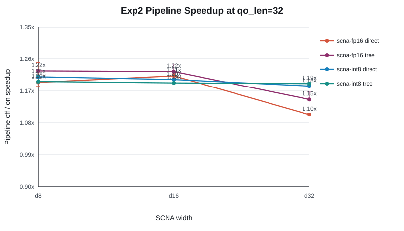
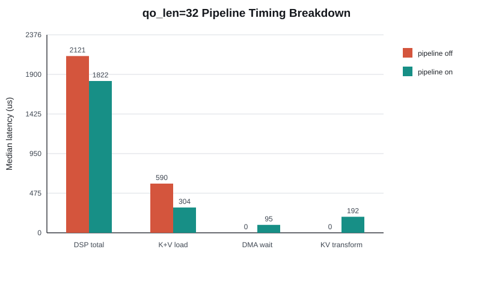

# V81 SCNA KV Pipeline Summary

Generated from adjacent pipeline-off/on runs. Confidence intervals are deterministic bootstrap 95% CIs of the median.

## Selected q32 configuration

- Configuration: scna-fp16 exp tree d8
- DSP median: 2121.0 us off -> 1821.5 us on (1.164x)
- DSP speedup 95% CI: [1.128x, 1.175x]
- Host speedup: 1.145x, 95% CI [1.129x, 1.178x]
- K+V median: 590.5 us off -> 303.5 us on
- Pipeline DMA issue/wait/transform: 9.0 / 95.0 / 192.0 us

## q32 matrix

| Mode | Function | Kernel | Width | Off DSP us | On DSP us | Pipeline speedup [95% CI] | Baseline speedup | On K+V us | DMA wait us |
|---|---|---|---:|---:|---:|---:|---:|---:|---:|
| scna-fp16 | exp | direct | 8 | 2420.0 | 1979.5 | 1.223x [1.218, 1.272] | 1.007x | 303.5 | 95.0 |
| scna-fp16 | exp | direct | 16 | 2900.0 | 2448.0 | 1.185x [1.175, 1.189] | 0.814x | 297.5 | 88.5 |
| scna-fp16 | exp | direct | 32 | 3965.5 | 3486.0 | 1.138x [1.136, 1.138] | 0.572x | 229.0 | 18.0 |
| scna-fp16 | exp | tree | 8 | 2121.0 | 1821.5 | 1.164x [1.128, 1.175] | 1.094x | 303.5 | 95.0 |
| scna-fp16 | exp | tree | 16 | 2382.5 | 1967.0 | 1.211x [1.202, 1.223] | 1.013x | 294.5 | 85.5 |
| scna-fp16 | exp | tree | 32 | 2603.5 | 2165.5 | 1.202x [1.189, 1.213] | 0.920x | 228.0 | 18.0 |
| scna-fp16 | exp2 | direct | 8 | 2432.0 | 2039.0 | 1.193x [1.182, 1.248] | 0.977x | 343.0 | 131.5 |
| scna-fp16 | exp2 | direct | 16 | 2995.5 | 2474.0 | 1.211x [1.199, 1.218] | 0.806x | 313.5 | 103.0 |
| scna-fp16 | exp2 | direct | 32 | 4007.5 | 3635.0 | 1.102x [1.100, 1.106] | 0.548x | 324.5 | 115.0 |
| scna-fp16 | exp2 | tree | 8 | 2261.0 | 1846.0 | 1.225x [1.222, 1.230] | 1.080x | 326.0 | 117.0 |
| scna-fp16 | exp2 | tree | 16 | 2417.5 | 1977.0 | 1.223x [1.217, 1.244] | 1.008x | 300.0 | 92.5 |
| scna-fp16 | exp2 | tree | 32 | 2663.5 | 2326.0 | 1.145x [1.143, 1.166] | 0.857x | 333.0 | 124.0 |
| scna-int8 | exp | direct | 8 | 2262.5 | 1882.0 | 1.202x [1.199, 1.206] | 1.059x | 228.0 | 18.0 |
| scna-int8 | exp | direct | 16 | 2719.0 | 2205.5 | 1.233x [1.229, 1.235] | 0.904x | 228.0 | 18.5 |
| scna-int8 | exp | direct | 32 | 3288.0 | 2899.5 | 1.134x [1.131, 1.137] | 0.687x | 229.0 | 20.0 |
| scna-int8 | exp | tree | 8 | 2386.5 | 1980.0 | 1.205x [1.202, 1.210] | 1.007x | 230.0 | 20.0 |
| scna-int8 | exp | tree | 16 | 2704.0 | 2307.5 | 1.172x [1.167, 1.178] | 0.864x | 346.5 | 138.5 |
| scna-int8 | exp | tree | 32 | 2797.5 | 2538.5 | 1.102x [1.098, 1.105] | 0.785x | 331.5 | 122.5 |
| scna-int8 | exp2 | direct | 8 | 2445.5 | 2024.0 | 1.208x [1.203, 1.211] | 0.985x | 328.5 | 121.0 |
| scna-int8 | exp2 | direct | 16 | 2639.0 | 2198.0 | 1.201x [1.199, 1.203] | 0.907x | 229.0 | 20.0 |
| scna-int8 | exp2 | direct | 32 | 3478.0 | 2941.5 | 1.182x [1.179, 1.184] | 0.678x | 246.0 | 36.0 |
| scna-int8 | exp2 | tree | 8 | 2535.5 | 2121.5 | 1.195x [1.189, 1.212] | 0.939x | 303.5 | 94.5 |
| scna-int8 | exp2 | tree | 16 | 2516.0 | 2112.0 | 1.191x [1.189, 1.193] | 0.944x | 228.0 | 18.0 |
| scna-int8 | exp2 | tree | 32 | 2951.0 | 2481.5 | 1.189x [1.186, 1.194] | 0.803x | 284.0 | 74.0 |
