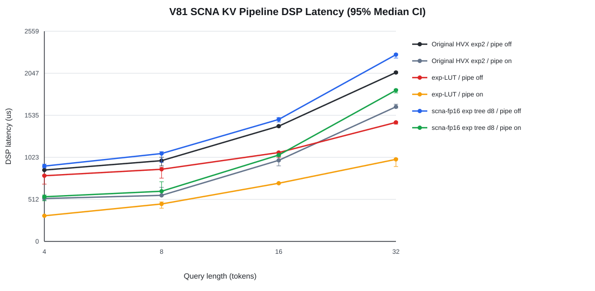
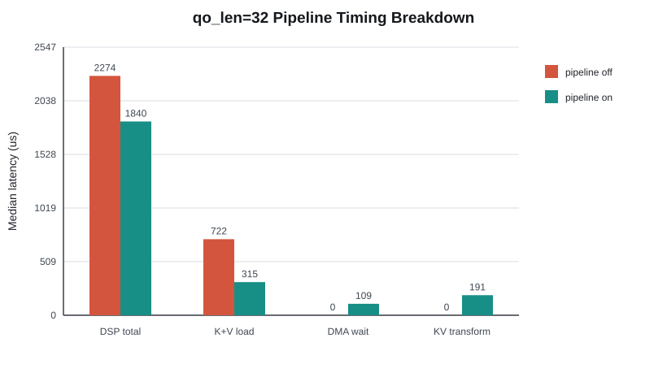

# V81 SCNA KV Pipeline Summary

Generated from adjacent pipeline-off/on runs. Confidence intervals are deterministic bootstrap 95% CIs of the median.

## Selected q32 configuration

- Configuration: scna-fp16 exp tree d8
- DSP median: 2274.0 us off -> 1840.5 us on (1.236x)
- DSP speedup 95% CI: [1.210x, 1.260x]
- Host speedup: 1.234x, 95% CI [1.225x, 1.246x]
- K+V median: 722.5 us off -> 315.0 us on
- Pipeline DMA issue/wait/transform: 9.0 / 109.0 / 191.0 us

## Fair evaluator comparison

| Qo | Reference | Reference / SCNA [95% CI] |
|---:|---|---:|
| 4 | baseline-pipeline-on | 0.960x [0.895, 1.067] |
| 4 | lut-exp-pipeline-on | 0.574x [0.555, 0.631] |
| 8 | baseline-pipeline-on | 0.918x [0.771, 1.079] |
| 8 | lut-exp-pipeline-on | 0.746x [0.599, 0.786] |
| 16 | baseline-pipeline-on | 0.939x [0.875, 0.982] |
| 16 | lut-exp-pipeline-on | 0.674x [0.667, 0.682] |
| 32 | baseline-pipeline-on | 0.891x [0.880, 0.920] |
| 32 | lut-exp-pipeline-on | 0.543x [0.495, 0.557] |

## q32 matrix

| Mode | Function | Kernel | Width | Off DSP us | On DSP us | Pipeline speedup [95% CI] | Baseline speedup | On K+V us | DMA wait us |
|---|---|---|---:|---:|---:|---:|---:|---:|---:|
| baseline | none | none | 0 | 2057.0 | 1639.0 | 1.255x [1.230, 1.269] | 1.255x | 303.0 | 91.5 |
| lut-exp | none | none | 0 | 1449.5 | 999.5 | 1.450x [1.421, 1.591] | 2.058x | 283.5 | 78.5 |
| scna-fp16 | exp | tree | 8 | 2274.0 | 1840.5 | 1.236x [1.210, 1.260] | 1.118x | 315.0 | 109.0 |
