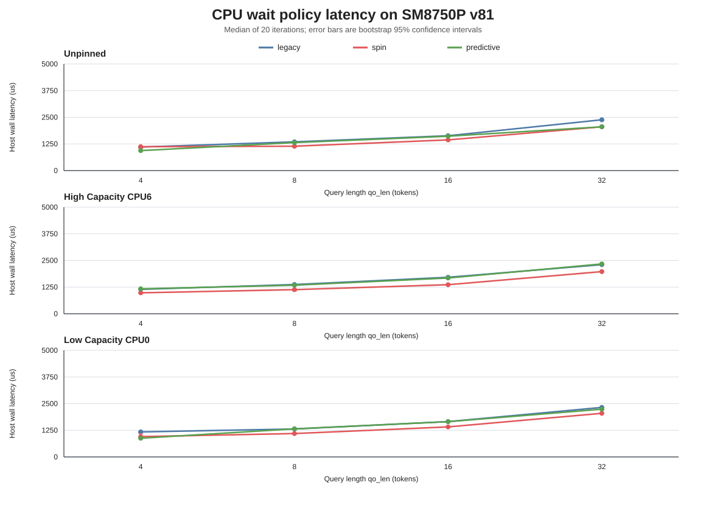
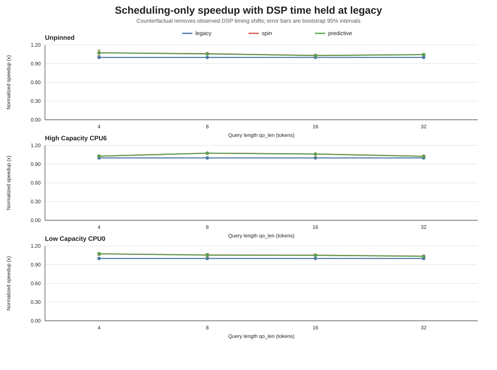
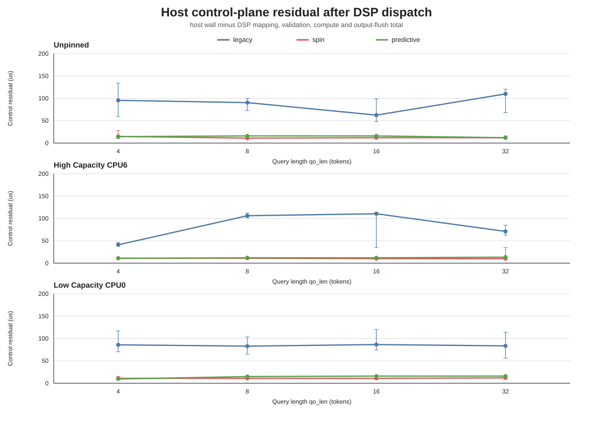
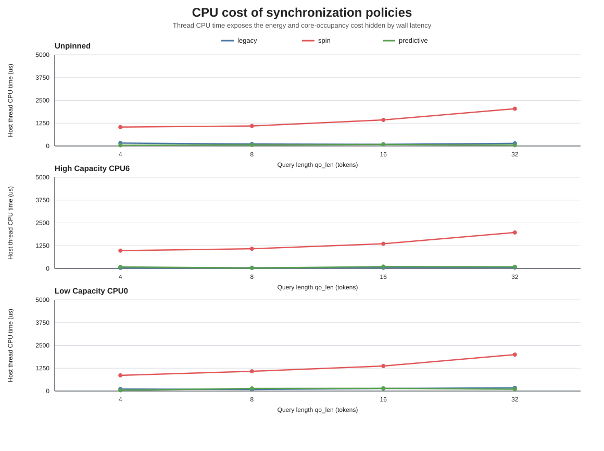
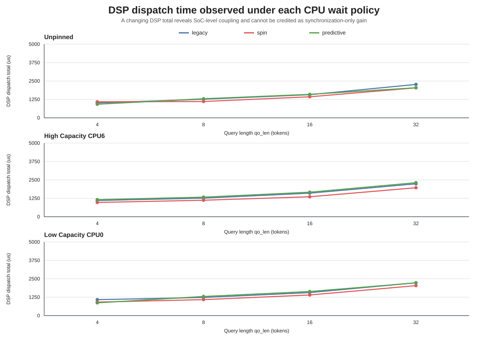
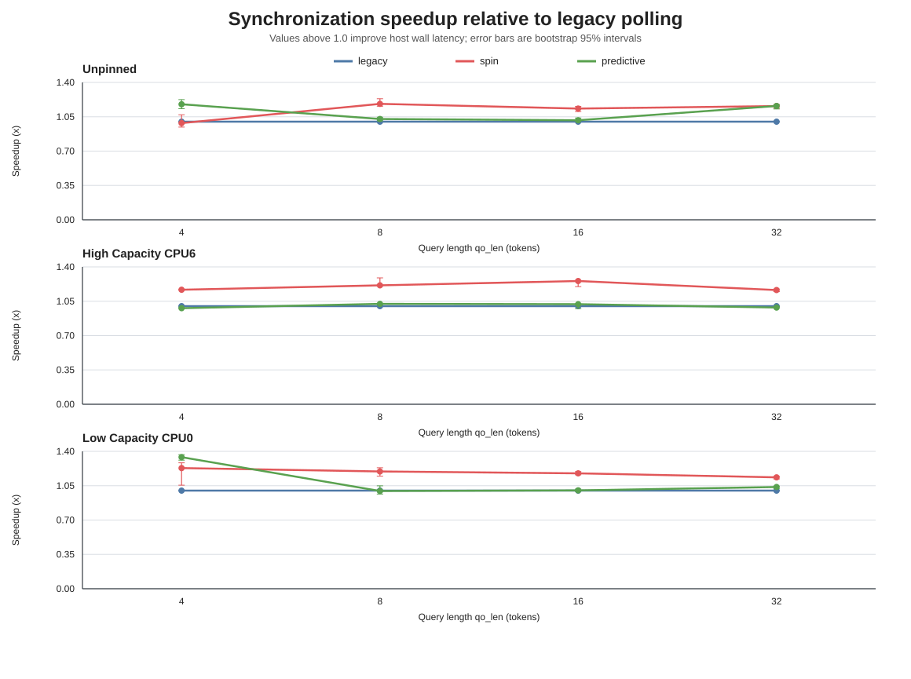
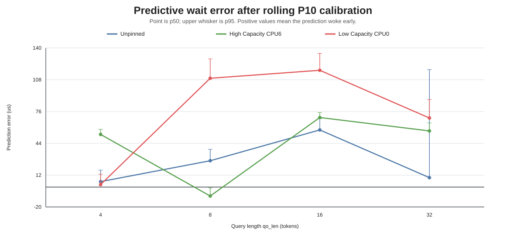

# HeteroInfer CPU 阶段一：预测等待与控制面剖析

日期：2026-08-01

平台：SM8750P / Hexagon v81 / Android 16

状态：实现、正确性门、实机主矩阵、统计分析均已完成

## 1. 工作概况

本阶段目标不是改变 Attention 数学计算，而是验证 HeteroInfer 第 4.3 节的控制面思想能否降低 CPU 等待 DSP 的同步开销。

- [x] 建立独立实验仓库与结果目录。
- [x] 保持 baseline `flash_attn.c` 不变，SHA-256 为 `6a8b025b...56cb`。
- [x] 实现 `legacy`、`spin`、`predictive` 三种等待策略。
- [x] 实现 request descriptor 一次预构建，rpcmem、channel、DSP fd mapping 全程常驻。
- [x] 增加 host wall/thread CPU/sleep/spin/poll/prediction error 逐次记录。
- [x] 增加 DSP `mapping/validate-in/compute/validate-out/total` 分解。
- [x] 完成 9 组正确性门和 36 配置、720 measured samples 的主矩阵。

一句话结论：predictive 将 host 控制残差从 `41.0-110.5 us` 降至 `9.5-16.0 us`，固定 DSP 时延后的调度净 speedup 为 `1.025x-1.076x`；其线程 CPU 时间中位数仅为 spin 的 `5.07%`，但端到端时延仍受 SoC 级 DSP/Fabric 耦合干扰。

## 2. 问题定义与假设

### 2.1 Motivation

原实现每隔 `usleep(50)` 检查共享完成标志。实机上一次 50 us 请求通常产生约 100 us 的实际睡眠粒度，可能在 DSP 已完成后继续睡眠。HeteroInfer 的核心启发是：相同 shape 的 kernel 延迟具有可预测性，可以先休眠到预计完成时间附近，再短时间 acquire-load 轮询完成标志。

### 2.2 Hypothesis

若等待预测稳定，则 predictive 应同时满足：

1. 控制残差接近纯 spin，而不是 legacy 的粗粒度唤醒延迟。
2. 线程 CPU 时间显著低于纯 spin。
3. 三种策略的 DSP 输出逐字节一致，且 DSP Attention kernel 源码不变。
4. 调度净收益不得超过 legacy 控制面完全消失时的 Amdahl 上限；若端到端观测超过该上限，超出部分必须归因于 DSP 时延变化，而不能归因于同步优化。

### 2.3 实验能否验证假设

host wall time 单独看不能区分同步收益与 DSP 波动。本阶段在同一次请求中记录：

`host_wall = DSP_dispatch + host_control_residual`

其中 DSP dispatch 又分解为 mapping、validate-in、compute、validate-out。报告同时给出：

- Observed speedup：直接比较 host wall，保留真实系统耦合。
- Normalized speedup：将所有策略的 DSP 时间固定为同组 legacy DSP 中位数，只比较控制残差。

## 3. 实现内容

### 3.1 Host 调度

- `--wait-policy legacy|spin|predictive`
  - legacy：保持 `usleep(50)` 轮询。
  - spin：持续 acquire-load 完成标志，仅每 1024 次 poll 读取一次超时钟。
  - predictive：先按滚动 P10 预测休眠，再 acquire-load 忙轮询。
- `--host-sync-calibration N`
  - 所有策略均先执行相同的 N 次 legacy 预校准，避免预热量不同。
  - 主实验使用 `N=20`，随后 5 次 warmup 中继续滚动更新 predictive P10，measured 阶段冻结预测。
  - 预测睡眠保留 100 us spin guard，以覆盖 Android 定时器粒度和短期抖动。
- `--host-cpu N`
  - 自动读取 CPU 最大频率与 capacity，并使用 `sched_setaffinity` 固定 benchmark 线程。
- `--output-bin PATH`
  - 导出原始输出，用 `cmp` 做跨策略逐字节验证。

### 3.2 请求生命周期

固定的 `RequestHeader + OpComputeRequest + FlashAttnProfileParams` 只组装一次。每轮仅清零 request state、以 release-store 提交、等待完成并读取返回码。输入输出 rpcmem、消息 channel 以及 DSP fd mapping 在整个进程中常驻，结束时统一释放。

### 3.3 DSP dispatch profiling

共享 profile header 增加 5 个 64-bit 字段：

- `dispatch_mapping_us`
- `dispatch_validate_in_us`
- `dispatch_compute_us`
- `dispatch_validate_out_us`
- `dispatch_total_us`

720 个 measured 样本中，`total - sum(components)` 的范围为 `0-1 us`，中位数为 `0 us`，分解闭合。

## 4. 实验设置

| 项目 | 设置 |
|---|---|
| Device | 25091RP04C，SoC `SM8750P`，ADB `bde3ddde` |
| DSP | Hexagon v81，SDK 6.6.0.0，Tools 19.0.07 |
| Build gate | 最终 DSP compile/link command 均包含 `-mv81` |
| Kernel | baseline Attention，源码 SHA-256 `6a8b025b...56cb` |
| Shape | `qo_len={4,8,16,32}`，`kv_len=4096`，heads/KV-heads=`12/2`，head-dim=`128` |
| Iterations | 每配置 20 次相同预校准、5 warmup、20 measured |
| Placement | unpinned；CPU0 low-capacity；CPU6 high-capacity |
| CPU topology | CPU0-5：3.5328 GHz/capacity 792；CPU6-7：4.32 GHz/capacity 1024 |
| Ordering | 三种策略使用旋转顺序，减轻固定先后偏差 |
| Statistics | median、p50、p95；median 与 speedup 使用 4000 次 bootstrap 95% CI |
| Thermal snapshot | battery 29.3 C，capacity 100% |

该 SoC 只有两个 CPU 频率域，没有传统三丛集意义上的 little/middle/prime。本文不虚构核类型，按 sysfs 实测标为 low-capacity 与 high-capacity。

## 5. 正确性结果

| Case | 策略数 | FP32 gate | 跨策略字节一致 | RMSE | Max abs error |
|---|---:|---:|---:|---:|---:|
| full，q4/kv4096/h128 | 3 | 3/3 pass | pass | 0.00133908 | 0.00618330 |
| causal，q8/kv4093/h128 | 3 | 3/3 pass | pass | 0.00132372 | 0.00628204 |
| padding，q16/kv4093/h64 | 3 | 3/3 pass | pass | 0.000541746 | 0.00167569 |

9 次 reference gate 均无 NaN/Inf。每个 case 的 legacy/spin/predictive 输出文件 SHA-256 完全相同；主矩阵中每个 placement × qo_len 的三种策略输出哈希也一致。

**Key Finding：** 等待策略只改变 CPU 控制路径，没有改变 Attention 输出。

## 6. 量化结果

### 6.1 端到端 host wall latency

**Key Finding：** predictive 的 observed speedup 范围为 `0.979x-1.341x`；12 个配置中 7 个 95% CI 显著快于 legacy、2 个显著慢于 legacy、3 个区间跨过 1.0。端到端结果并不单调，不能直接视为同步收益。

### 6.2 固定 DSP 时延后的调度净收益

**Key Finding：** predictive 的 normalized speedup 为 `1.0247x-1.0757x`，12/12 配置的 bootstrap 95% CI 下界均高于 1.0。这验证了“预测休眠加短轮询”能稳定减少控制面等待。

### 6.3 Host 控制残差

legacy 控制残差中位数为 `41.0-110.5 us`；spin 为 `10.0-15.0 us`；predictive 为 `9.5-16.0 us`。predictive 相比 legacy 消除了 `73.2%-89.1%` 的控制残差。

**Key Finding：** predictive 已达到与 spin 同一量级的同步精度，主要剩余为 channel 检测、完成标志传播与 host 读回，而不是 50 us sleep 量化误差。

### 6.4 CPU 使用代价

| 指标范围 | legacy | spin | predictive |
|---|---:|---:|---:|
| Thread CPU median | 35-177 us | 859-2042.5 us | 26.5-148 us |
| CPU utilization median | 2.4%-14.0% | 91.4%-99.9% | 2.0%-10.7% |
| Busy-spin median | 2.5-8.5 us | 925.5-2046 us | 20.5-135 us |

按配置配对后，predictive/thread CPU 与 spin/thread CPU 的中位比为 `0.0507`，即 CPU 时间减少约 `19.7x`。

**Key Finding：** 纯 spin 以占满一个核换取同步精度；predictive 保留近似同步精度，但 CPU 代价回到 legacy 同一数量级。

### 6.5 DSP dispatch 与系统耦合

predictive 的 DSP dispatch 相对 legacy 偏移范围为 `-20.0%` 到 `+5.6%`，spin 为 `-15.4%` 到 `+7.5%`。24 个非 legacy 配置中有 14 个 observed speedup 超过 legacy 的零控制开销 Amdahl 上限 `1.031x-1.089x`。

**Key Finding：** 超出 Amdahl 上限的部分来自 DSP/Fabric 时延变化，可能由 CPU 活跃度、共享互连频率、DVFS 或配置间时间漂移触发，不属于同步算法本身。

### 6.6 q32 代表性分解

| Placement | Policy | Host us | DSP us | Control us | Thread CPU us | Observed | Normalized |
|---|---|---:|---:|---:|---:|---:|---:|
| unpinned | legacy | 2381.5 | 2269.0 | 110.0 | 144.5 | 1.000x | 1.000x |
| unpinned | spin | 2054.5 | 2036.0 | 12.0 | 2042.5 | 1.159x | 1.044x |
| unpinned | predictive | 2053.5 | 2042.0 | 12.0 | 48.5 | 1.160x | 1.044x |
| low-capacity CPU0 | legacy | 2322.5 | 2230.5 | 83.5 | 177.0 | 1.000x | 1.000x |
| low-capacity CPU0 | spin | 2045.5 | 2034.0 | 12.0 | 1998.5 | 1.135x | 1.036x |
| low-capacity CPU0 | predictive | 2239.5 | 2223.0 | 16.0 | 99.0 | 1.037x | 1.034x |
| high-capacity CPU6 | legacy | 2303.5 | 2234.5 | 71.0 | 54.5 | 1.000x | 1.000x |
| high-capacity CPU6 | spin | 1978.5 | 1969.5 | 10.0 | 1975.5 | 1.164x | 1.026x |
| high-capacity CPU6 | predictive | 2337.0 | 2312.0 | 13.5 | 95.5 | 0.986x | 1.025x |

**Key Finding：** unpinned q32 中 predictive 与 spin 的 host latency 几乎相同，但 predictive 只使用 `48.5 us` thread CPU，spin 使用 `2042.5 us`；high-capacity q32 则因 DSP total 增加而表现为端到端回退，normalized 结果仍为正收益。

### 6.7 预测误差

predictive prediction error p50 范围为 `-9.0` 到 `117.5 us`，p95 为 `-0.8` 到 `134.5 us`。正值表示实际完成晚于 P10 预测，负值表示 DSP 已在休眠期间完成。

**Key Finding：** N=20 消除了 5 样本 P10 退化为单个最小值的问题，但跨核与跨 shape 的 100 us 级尾部漂移仍存在，是下一阶段自适应预测器的直接优化目标。

## 7. 异常分析与限制

### 7.1 为什么 observed speedup 会超过理论上限

例如 low-capacity CPU0/q4 的 predictive observed speedup 为 `1.341x`，但 normalized speedup 只有 `1.075x`；同期 DSP dispatch 比 legacy 低 `20.0%`。因此该点不能表述为“CPU 调度带来 34.1% 加速”，只能表述为“控制面贡献约 7.5%，其余来自系统耦合”。

可能机制：

1. 忙轮询或定时唤醒改变 CPU cluster 与共享 fabric 的活跃状态。
2. DSP HAP power 虽请求 performance/TURBO_L3，实际共享互连和内存路径仍可能受系统级 governor 影响。
3. 20 个 measured 样本在同一进程内连续采集，bootstrap CI 描述组内稳定性，不覆盖跨进程/跨时段方差。

### 7.2 CPU 核类型限制

目标设备没有传统 little 核。CPU0 是本机最低 capacity 的可用核，CPU6 是最高 capacity 核。实验结论只能推广到这两个真实频率域，不能直接映射为其他 SoC 的 little/middle 核收益。

### 7.3 研究边界

- 本阶段只测 standalone baseline Attention 请求，没有实现 GPU-NPU tensor parallelism。
- 没有把 HeteroInfer 的模型端到端加速数字套用到本项目。
- 输入为固定 seed 的 synthetic Figure8 case，未测完整模型 token latency 与能耗。
- request descriptor 预构建已在 benchmark host stub 验证，尚未接入完整 llama runtime 的多 op 调度器。

## 8. 下一阶段行动

1. 用 counter-balanced 多轮独立进程重复 q4/q16/q32，并同步采集 CPU/fabric/DSP clock，验证 DSP dispatch 偏移的来源。
2. 将固定 P10 扩展为带 drift clamp 的在线滚动预测，并以 `prediction error p95 < 50 us` 为量化目标。
3. 记录能耗或至少 CPU residency/frequency，验证 predictive 的 `19.7x` thread CPU 降幅是否转化为系统功耗收益。
4. 将 prepared descriptor 与 wait policy 接入生产请求队列，验证多 op 连续提交时 mapping 与 channel 常驻收益。

## 9. 数据与复现入口

- Raw logs：`results/v81/heteroinfer-cpu/stage1-main-20260801/raw/`
- Device CSV：`results/v81/heteroinfer-cpu/stage1-main-20260801/device-csv/`
- Iteration samples：`results/v81/heteroinfer-cpu/stage1-main-20260801/summary/iteration_samples.csv`
- Aggregated CSV：`results/v81/heteroinfer-cpu/stage1-main-20260801/summary/summary.csv`
- Correctness：`results/v81/heteroinfer-cpu/stage1-correctness-20260801/`
- Runner：`scripts/run_heteroinfer_cpu_v81.sh`
- Analyzer：`scripts/analyze_heteroinfer_cpu.py`

本阶段结论遵循 HeteroInfer 的“预测等待加短轮询”思想，但所有收益均来自本项目 SM8750P/v81 实测，不引用其 GPU-NPU 端到端结果作为本实验结论。
