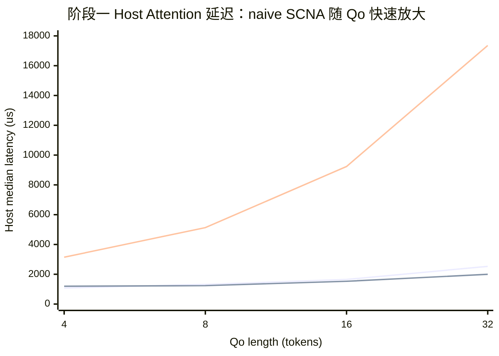
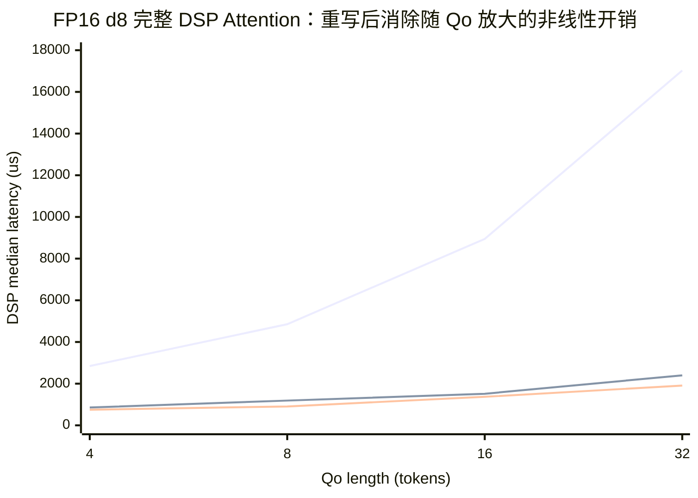
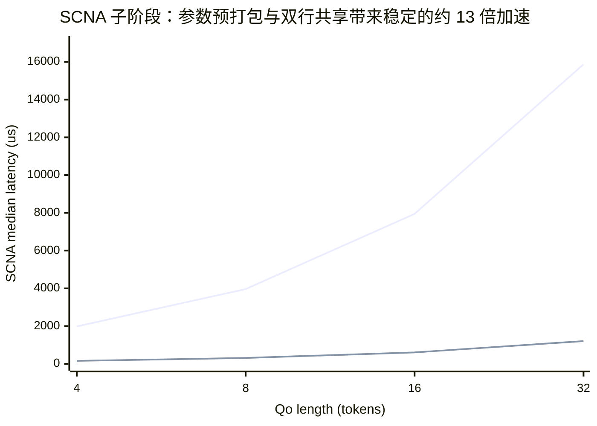
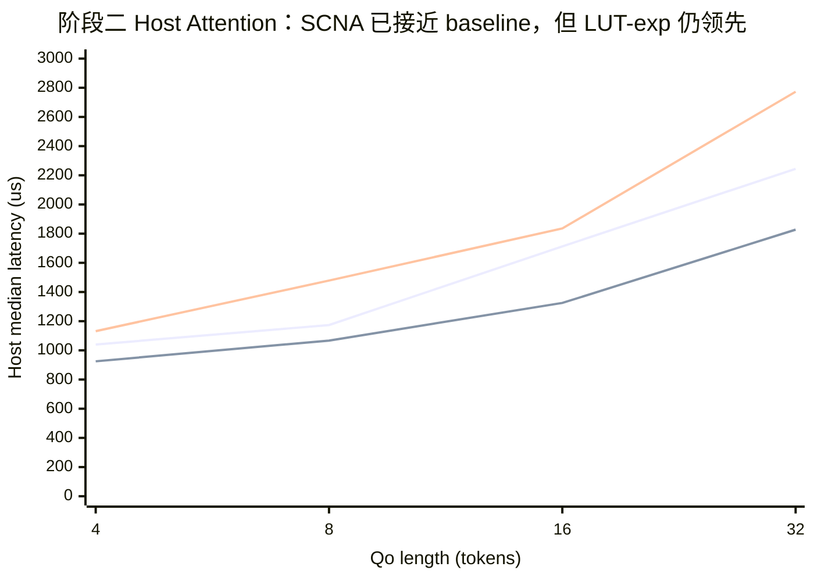

# SCNA on HVX：阶段一与阶段二总结

> 核心结论：阶段一证明了 SCNA 可以完整替换 online safe-softmax 中两处 `exp2`，但 naive HVX 实现使 d8 Attention 比 baseline 慢 2.9–6.9 倍；阶段二针对参数转换、重复 broadcast、运行时 width 分支和双行重复计算重写内核，使 SCNA 子阶段加速 12.6–13.2 倍，完整 DSP Attention 加速 3.3–7.1 倍。

> **数据有效性更新（2026-08-01）：** 阶段四加入 FP32 reference 后发现，旧 `flash_attn.c` 的两行归约写回会丢失第一对 rowsum，且 v81 错用了 SDK 仅面向 `<v79` 的 reciprocal 实现，导致 `l=0 -> inv(l)=Inf`；`kv_len=4093` 的 host mask 也未按 64 列 padded stride 分配。所以下文 microkernel 延迟/误差和 SCNA 子阶段计时仍有效，Attention latency 仅保留为历史执行成本；旧 `ret=0`、无 NaN/Inf、mask/tail 与端到端正确性结论已撤回，必须以修复后的重测矩阵替代。

## 1. 工作概况

| 项目 | 阶段一：功能 Demo 与基线定位 | 阶段二：SCNA 热路径重写 |
|---|---|---|
| 目标 | 在 SM8750P/v81 上跑通 SCNA FlashAttention 并建立 baseline | 消除阶段一定位到的 safe-softmax/SCNA 瓶颈 |
| 状态 | 已完成 | 已完成 |
| 主要产物 | FP16/INT8-parameter d8/d16/d32 microkernel、四模式 Attention、profiling、ADB 矩阵 | 静态 width kernel、参数预打包、双行共享、FP16 `vmpyacc`、可靠 micro 计时 |
| 实机验证 | 完整 Figure8 矩阵、causal、padding、KV 尾块 | 完整复测矩阵、相同 mask/尾块回归 |
| 下一阶段 | 由阶段一数据驱动进入内核重写 | 真正 S8 activation + S16/S32 中间结果 |

## 2. 问题定义与逻辑链

### 2.1 背景

现有 `flash_attn.c` 是 HMX tile GEMM 与 HVX online safe-softmax 组合的 FlashAttention 风格 kernel。score 已乘以 `log2(e)/sqrt(d)`，因此非线性目标是：

\[
P = 2^{S-m}, \qquad l_{new}=2^{m_{prev}-m_{new}}l_{prev}+\mathrm{rowsum}(P)
\]

SCOPE/SCNA 将 `exp2(x)` 表示为正权重 ReLU 和：

\[
\widehat{\exp_2}(x)=\sum_{i=1}^{d}\max(x\cdot wk_i+bk_i,0),\quad x\in[-256,0]
\]

### 2.2 假设

- **H1（功能）**：SCNA 可替换 P-tile 与 running-max 两处 `exp2`，且 mask lane 保持为 0、尾块不产生 NaN/Inf。
- **H2（精度-性能）**：width 从 d8 增至 d32 会降低近似误差，但延迟近似线性增加。
- **H3（阶段一性能）**：直接用 HVX FP16 实现 SCNA 后，Attention 延迟能够接近现有 baseline。
- **H4（阶段二性能）**：若移除 block 内参数转换和重复 broadcast，并让两行共享系数，SCNA 子阶段应获得至少 10 倍加速。

实验设计同时覆盖 microkernel 和完整 Attention，因此能够区分“近似函数计算慢”与“QK/PV/load 慢”。

## 3. 实验设置

| 类别 | 设置 |
|---|---|
| SoC / DSP | SM8750P，Hexagon v81，128-byte HVX |
| 构建 | Hexagon SDK 6.6.0.0 / Tools 19.0.07；确认 `-mv81 -mhvx -mhvx-length=128B` |
| Attention shape | `qo_len={4,8,16,32}`，`kv_len=4096`，heads/KV-heads=`12/2`，head-dim=128 |
| 统计 | 单 worker；5 warmup + 20 measured；报告 median、p95、bootstrap median 95% CI |
| 显著性 | 双侧随机置换检验，9999 permutations，固定 seed |
| Baseline | 原始 HVX `exp2`；另报告 LUT-exp |
| SCNA | FP16 与 INT8-parameter，d8/d16/d32；输入 clamp 到 `[-256,0]` |
| 回归 | causal、padding、`kv_len=4093`、head-dim 64/128 |

> 注意：当前 `scna-int8` 是 INT8 参数反量化后执行 FP16 HVX，不是真正的 S8 activation kernel。因此它只用于量化误差基线，不能代表最终 INT8 性能。

## 4. 阶段一：SCNA Demo 与瓶颈定位

### 4.1 做了什么

1. 在 SCOPE 训练程序增加 `exp2` 的 `[-256,0]` d8/d16/d32 批量训练与 HVX 参数导出流程。
2. 实现 64-lane FP16 SCNA microkernel，并提供 INT8 参数量化仿真路径。
3. 将 SCNA 接入 `P=2^(S-m)` 与 `2^(m_prev-m_cur)`；mask lane 在 SCNA 后显式清零。
4. 增加 `baseline/lut-exp/scna-fp16/scna-int8`、width、mask、CSV 与分阶段 timer。
5. 在 SM8750P 上执行完整矩阵并保存 raw log/CSV。

### 4.2 Attention 延迟结果

图例：第一条线为 baseline，第二条线为 LUT-exp，第三条线为 SCNA-FP16 d8。

**Key Finding：** d8 已是最快 SCNA，但 host median 仍比 baseline 高 2.92×、3.89×、5.59×、6.86×；四个 Qo 的差异均显著（置换检验 `p=0.0001`）。H3 被否定。

| Qo | Baseline host median [95% CI] (us) | SCNA d8 host median [95% CI] (us) | SCNA/Baseline | SCNA p95 (us) |
|---:|---:|---:|---:|---:|
| 4 | 1076.5 [1031.0, 1184.5] | 3145.0 [3113.0, 3176.0] | 2.92× | 3216.2 |
| 8 | 1318.5 [1281.0, 1366.5] | 5132.5 [5051.0, 5173.0] | 3.89× | 5226.4 |
| 16 | 1651.5 [1627.5, 1729.5] | 9234.0 [9215.0, 9313.5] | 5.59× | 9349.0 |
| 32 | 2530.0 [2508.0, 2556.5] | 17358.0 [17321.5, 17380.5] | 6.86× | 17524.2 |

### 4.3 精度-计算量结果

```mermaid
xychart-beta
    title "阶段一 SCNA microkernel：width 增加带来近似线性延迟"
    x-axis "SCNA width" [8, 16, 32]
    y-axis "1000 vectors latency (us)" 0 --> 3000
    bar [606, 1268, 2561]
    bar [693, 1384, 2847]
```

图例：第一组为 FP16，第二组为 INT8-parameter；每个 vector 有 64 个 FP16 lane。

| Width | FP16 RMSE | FP16 max abs error | FP16 latency/1000 vectors | INT8-parameter RMSE |
|---:|---:|---:|---:|---:|
| d8 | 2.3199e-3 | 1.85189e-2 | 606 us | 5.2965e-3 |
| d16 | 3.70481e-4 | 2.95497e-3 | 1268 us | 1.26392e-2 |
| d32 | 8.33108e-5 | 4.88281e-4 | 2561 us | 1.85082e-2 |

**Key Finding：** FP16 d32 相对 d8 将 RMSE 降低 27.8×，但 micro latency 增加 4.23×，验证 H2。当前逐参数独立量化使 INT8 d16/d32 的误差反而高于 d8，说明量化 scale 设计需要重做。

### 4.4 瓶颈归因

| Qo | SCNA d8 DSP total (us) | SCNA 子阶段 (us) | SCNA 占 DSP total |
|---:|---:|---:|---:|
| 4 | 2847.0 | 1984.0 | 69.7% |
| 8 | 4852.5 | 3962.0 | 81.7% |
| 16 | 8946.0 | 7946.5 | 88.8% |
| 32 | 17025.5 | 15869.5 | 93.2% |

底层原因不是 QK/PV，而是每个 64-element block 中重复执行：参数表查询、`__fp16→float→__fp16`、运行时 width 判断、两行分别 broadcast `w/b`，并用多条 qf16 指令完成 multiply/add/convert。

阶段一结论：H1、H2 成立，H3 被数据否定；下一步不应先做 KV ping-pong，而应先消除 SCNA compute 本身的冗余。

## 5. 阶段二：HVX SCNA 热路径重写

### 5.1 做了什么

1. 每次 Attention op 只准备一次参数，保存为 packed FP16 bit-pattern，移除 block 内浮点转换。
2. 生成 d8/d16/d32 三个固定 width kernel，消除 unit-loop 中的运行时 width 分支。
3. 将两行 score 合并计算，使 `w/b` broadcast 被 row0/row1 共享。
4. 使用 v81 FP16 `vmpyacc`，将 affine multiply/add 合并；`vmpyacc` 与 `vmax/vadd` 分属 multiply 与 VA 资源，便于调度器交错发射。
5. 初版全内联导致 `simple_flash_attn_f16_core` worker stack 溢出；根据 cDSP `Bad VA=0` 与 fault PC 定位后，将各 width kernel 隔离为 `noinline` 函数，Attention 栈帧降至 5760 bytes。
6. 修复 microbenchmark 循环被编译器提升，以及 host 汇总遗漏 width 的统计缺陷。

### 5.2 重写前后对比

图例：第一条线为重写前 SCNA d8，第二条线为重写后 SCNA d8，第三条线为同轮 baseline。

**Key Finding：** 完整 DSP Attention 获得 3.33×、4.08×、5.90×、7.09× 加速；四个 Qo 的 before/after 差异均为 `p=0.0001`，验证优化不是测量噪声。

图例：第一条线为重写前，第二条线为重写后。

| Qo | 重写前 SCNA (us) | 重写后 SCNA (us) | 子阶段加速 | 完整 DSP 加速 | Host median 改善 |
|---:|---:|---:|---:|---:|---:|
| 4 | 1984.0 | 158.0 | 12.56× | 3.33× | 3145.0 → 1131.5 us (-64.0%) |
| 8 | 3962.0 | 313.0 | 12.66× | 4.08× | 5132.5 → 1478.5 us (-71.2%) |
| 16 | 7946.5 | 607.0 | 13.09× | 5.90× | 9234.0 → 1835.5 us (-80.1%) |
| 32 | 15869.5 | 1206.0 | 13.16× | 7.09× | 17358.0 → 2773.0 us (-84.0%) |

### 5.3 优化后的 Baseline 对比

图例：第一条线为 baseline，第二条线为 LUT-exp，第三条线为优化后 SCNA-FP16 d8。

| Qo | Baseline host [95% CI] (us) | LUT host (us) | SCNA d8 host [95% CI] (us) | SCNA vs baseline | p-value |
|---:|---:|---:|---:|---:|---:|
| 4 | 1040.0 [994.0,1081.5] | 925.0 | 1131.5 [1112.0,1140.5] | +8.8% | 0.0002 |
| 8 | 1173.5 [1155.5,1233.0] | 1067.0 | 1478.5 [1406.5,1515.0] | +26.0% | 0.0001 |
| 16 | 1712.5 [1641.5,1740.0] | 1325.0 | 1835.5 [1799.5,1872.5] | +7.2% | 0.0012 |
| 32 | 2244.5 [2214.5,2274.0] | 1827.5 | 2773.0 [2742.0,2793.5] | +23.5% | 0.0001 |

**Key Finding：** H4 成立，但 SCNA d8 尚未超过 baseline；剩余差距在 Qo=4/16 为 7–9%，在 Qo=8/32 为 24–26%。LUT-exp 在所有 Qo 上仍是当前性能最优点。

### 5.4 精度是否因重写退化

```mermaid
xychart-beta
    title "SCNA microkernel 重写前后延迟（1000 个 64-lane vectors）"
    x-axis "SCNA width" [8, 16, 32]
    y-axis "Latency (us)" 0 --> 2700
    bar [606, 1268, 2561]
    bar [40, 71, 116]
```

图例：第一组为重写前，第二组为重写后。

| Width | 重写后 latency | Micro 加速 | 重写前 RMSE | 重写后 RMSE | RMSE 变化 |
|---:|---:|---:|---:|---:|---:|
| d8 | 40 us | 15.15× | 2.31990e-3 | 2.31996e-3 | +0.003% |
| d16 | 71 us | 17.86× | 3.70481e-4 | 3.78106e-4 | +2.06% |
| d32 | 116 us | 22.08× | 8.33108e-5 | 8.59679e-5 | +3.19% |

**Key Finding：** `vmpyacc` 的单次舍入使 d16/d32 RMSE 小幅增加，但绝对误差仍分别为 `3.78e-4` 与 `8.60e-5`；性能收益远大于误差变化。是否可接受最终仍需由 Attention 输出误差和困惑度验证。

## 6. 异常分析与局限

### 6.1 Unexpected Results

- **阶段一 INT8 越宽误差反而越高**：原因是 weight 与 bias 分别对称量化后再反量化，量化误差会按 unit 数累积；它不代表真正的 fixed-point SCNA。
- **阶段二全内联首次导致 cDSP crash**：三档 kernel 与 pair path 同时展开，使 worker 函数序言发生 stack overflow。该异常通过 cDSP fault PC 和 `Bad VA=0` 定位，已由 width kernel 隔离解决。
- **SCNA d8 尚未超过 baseline**：尽管 SCNA compute 已快 13 倍，单个 `exp2` 仍需 8 组 affine/ReLU/add；原生 `exp2` 与 LUT 的指令数更少。

### 6.2 Limitations

- 当前参数是 bring-up bootstrap spline，不是最终 SCOPE 训练得到的最佳参数。
- `scna-int8` 仍使用 FP16 执行单元；尚不能回答 INT8 HVX 是否有性能优势。
- 当前数值验证停留在 `exp2` 网格误差与运行稳定性；尚未记录 Attention output RMSE/max error，也未跑 WikiText-2 perplexity。
- 主结果为单 worker，不能外推到多 worker scalability。
- 各 mode 按固定顺序执行，尚未随机化 run order；温度与 DVFS 仍可能影响跨 mode 的小差异。

## 7. 阶段三计划：真正的 S8/S16-S32 SCNA

### 7.1 假设

将输入按固定 step 量化到 S8，使用共同 affine scale 将 `wk/bk` 变成整数，并用 HVX byte multiply 产生 S16、S32 累加，可消除 FP16 coefficient broadcast/FMA。目标是：

- d8 micro latency 相对当前 FP16 d8 再降低至少 20%；
- Attention SCNA 子阶段不高于 baseline safe-softmax 的 1.2 倍；
- d8 RMSE 不高于当前 INT8-parameter 路径的 `5.30e-3`；
- 所有 mask/tail case 保持 `ret=0` 且无 NaN/Inf。

### 7.2 Action Items

1. 统一量化公式：`q_x=round(x/input_step)`，为每个 unit 导出整数 `q_w/q_b` 与共同 affine scale，保证 `q_x*q_w+q_b` 不溢出 S16。
2. 实现独立 S8 HVX microkernel，验证 lane pack 顺序、S16 product、ReLU、S32 accumulation 与 FP16 dequant。
3. 对 d8/d16/d32 执行 grid/random/boundary/tail 数值回归，并用同样的 1000-vector benchmark 测量。
4. 仅在 microkernel 达到目标后接入 Attention，避免将不成熟定点路径混入 HMX pipeline。
5. 完成阶段三后按本文同一模板输出数据、图、显著性、异常与下一阶段计划。

## 8. 数据与代码索引

- 阶段一原始数据：`results/v81/scna/sm8750p-20260731-2300/`
- 阶段二原始数据：`results/v81/scna/sm8750p-optimized-final-20260731-2355/`
- 汇总 CSV：各结果目录下 `summary/summary.csv` 与 `summary/pareto.csv`
- SCNA kernel：`src/htp-ops-lib-main/src/dsp/ops/scna_exp2.c`
- Attention 接入：`src/htp-ops-lib-main/src/dsp/ops/flash_attn.c`
- 参数与部署结构：`src/htp-ops-lib-main/include/dsp/scna_exp2.h`

## 9. 汇报前 Checklist

- [x] 每项结论包含 baseline 与定量对比。
- [x] 图表包含标题、横轴、纵轴、单位和图例说明。
- [x] 报告 n、median、p95/95% CI 与显著性检验。
- [x] 解释成功与失败背后的底层原因。
- [x] 明确列出限制和可验证的下一阶段假设。
