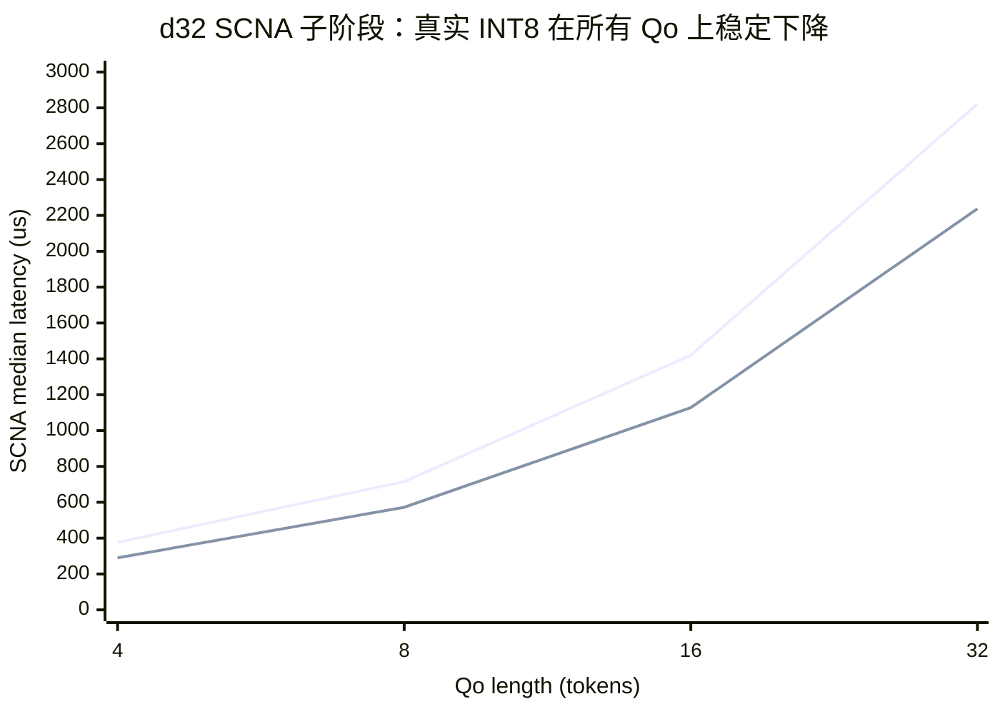
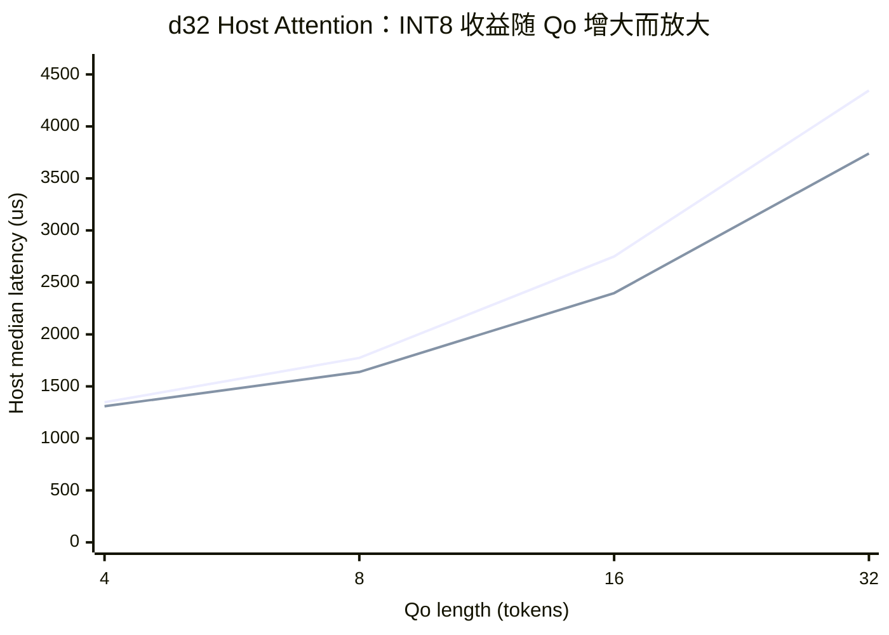

# SCNA on HVX：阶段三真实 INT8 内核总结

> 核心结论：阶段三完成了真实 `S8 activation × S8 weight + S16 bias/accumulation` 的 HVX SCNA，并接入 online safe-softmax。d32 在 `qo_len=16/32` 上使 SCNA 子阶段加速 25.9%/26.2%，完整 DSP 加速 16.9%/16.8%；代价是 `[-16,0]` 密集网格 RMSE 从 FP16 的 0.00245 增至 0.00828。d8 没有获得预期加速，假设被数据否定。

> **数据有效性更新（2026-08-01）：** 阶段四的 FP32 reference 检查发现旧 Attention baseline 与全部 nonlinear mode 共享归一化缺陷：两行归约结果没有正确写回 `m/l` vector，v81 还调用了只适用于 `<v79` 的 reciprocal 多项式；非对齐 `kv_len` 的 mask buffer 同时存在 padded-stride 契约错误。因此本报告的 SCNA microkernel 数值/吞吐结论仍有效，SCNA 子阶段和 Attention latency 只代表旧 kernel 的执行成本；`ret=0` 的 mask/tail 回归与旧端到端正确性结论无效。修复后必须重新执行完整性能和精度矩阵，旧数据不得进入最终 Pareto 图。

## 1. 工作概况

| 项目 | 状态 | 结果 |
|---|---|---|
| 真实整数 microkernel | 已完成 | S8 activation、S8 weight、S16 bias/ReLU/sum、FP16 输出 |
| 双行 HVX pipeline | 已完成 | 两个 64-lane row 打包为一个 byte vector，一次 `vmpy` 同时计算两行 |
| 固定域量化转换 | 已完成 | 直接解析 FP16 exponent/mantissa 计算 `trunc(x*8)` |
| SCOPE 导出契约 | 已完成 | 导出 S8 weight、S16 bias、output scale 和溢出元数据 |
| v81 性能矩阵 | 已完成 | 6 个 SCNA 配置 × 4 个 Qo，5 warmup + 20 measured |
| mask/tail 回归 | 已撤回 | 旧测试仅验证 `ret=0`，且 `kv_len=4093` mask stride 错误；等待修复后重测 |
| 下一阶段 | 进行中 | Attention tile 级 ping-pong 与 load/compute overlap |

## 2. 问题与假设

阶段二的 `scna-int8` 只将 INT8 参数反量化为 FP16 后执行，无法验证整数 HVX 的真实性能。阶段三要回答：利用 byte multiply 的两倍 lane 密度，能否在保持在线 softmax 数据格式不变的前提下超过 FP16 SCNA？

量化计算为：

\[
q_x=\operatorname{trunc}(8\cdot\operatorname{clip}(x,-16,0)),
\quad z_i=\max(q_xq_{w_i}+q_{b_i},0),
\quad y=s_o\sum_i z_i
\]

其中 `q_x/q_w` 为 S8，`q_b/z/sum` 为 S16，`s_o=weight_scale/8`。

| 假设 | 判据 | 结果 |
|---|---|---|
| H1：整数路径数值与 lane 布局正确 | pair 与两个 single 输出一致；无负值、NaN/Inf、单调性违例 | 成立 |
| H2：d8 pair 至少比 FP16 快 20% | 1000 次 pair microbenchmark | 不成立：55 us vs 54 us |
| H3：较大 width 能利用 byte multiply 密度 | d16/d32 pair 快于对应 FP16 | 成立：快 12.8%/24.6% |
| H4：microkernel 收益能传递到 Attention | SCNA 子阶段和完整 DSP 同时下降 | d32 成立，d16部分成立，d8不成立 |

## 3. 实验设置

| 配置项 | 设置 |
|---|---|
| Device | SM8750P 实机，ADB device `bde3ddde` |
| DSP | Hexagon v81；最终编译命令已核验包含 `-mv81` |
| Attention case | `kv_len=4096`，heads `12/2`，head-dim 128，`qo_len={4,8,16,32}` |
| Repetition | 单 worker；5 warmup + 20 measured |
| Microbenchmark | 20 warmup + 1000 measured；single 与 pair 分别计时 |
| Accuracy | 原 64 点稀疏网格 + `[-16,0]` 1024 点密集网格 |
| Baseline | 同批次 SCNA-FP16；完整 Attention 另含 baseline 与 LUT-exp |
| Statistics | median、p95、bootstrap median 95% CI、9999 次双侧置换检验 |

## 4. 实现与归因

### 4.1 做了什么

1. 将旧 INT8-parameter 路径替换为真实 S8×S8 HVX `vmpy`，ReLU 与累加保持 S16，末端一次性转回 FP16。
2. pair kernel 把两行量化数据打包到一个 128-byte vector；`vmpy` 的 even/odd 输出通过 `vshuff(...,-2)` 恢复顺序。
3. d8/d16/d32 继续采用编译期固定循环和 out-of-line kernel，避免恢复运行时 width 分支或扩大 worker stack。
4. 拒绝了误差过大的共同 S8 bias scale，改用 S16 bias；d8/d16/d32 最大 ReLU sum 为 2920/3914/5687，均满足 S16。
5. 将通用 FP16 floor 转换重写为固定域 bit conversion，去掉 FP multiply 和不需要的 fractional 输出。
6. 扩展 microbenchmark，新增 pair 吞吐、1024 点密集误差、边界输出、单调性、非负性和 pair/single 一致性。
7. 更新 SCOPE exporter，使导出格式与 DSP 真正执行的 S8/S16 公式一致。

### 4.2 Microkernel 吞吐

```mermaid
xychart-beta
    title "SCNA pair microkernel：真实 INT8 只在 d16/d32 获益"
    x-axis "SCNA width" [8, 16, 32]
    y-axis "1000 pair calls latency (us)" 0 --> 200
    bar [54, 94, 183]
    bar [55, 82, 138]
```

图例：第一组为 FP16，第二组为真实 INT8；一次 pair call 处理两个 64-lane vectors。

**Key Finding：** d8 的固定转换成本抵消了 byte multiply 收益；当 affine/ReLU 数增至 d16/d32 后，pair 分别加速 12.8% 和 24.6%，验证收益来自更高的 byte lane 利用率，而不是计时误差。

| Width | FP16 pair (us) | INT8 pair (us) | INT8 speedup | Pair vs single max diff |
|---:|---:|---:|---:|---:|
| 8 | 54 | 55 | 0.98× | 0 |
| 16 | 94 | 82 | 1.15× | 0 |
| 32 | 183 | 138 | 1.33× | 0 |

### 4.3 Attention 子阶段

图例：第一条线为 FP16 d32，第二条线为真实 INT8 d32。

**Key Finding：** d32 SCNA 子阶段获得 25.0%–29.8% 的稳定加速；`qo_len=16/32` 的差异均显著（置换检验 `p<=0.0005`），因此 microkernel 优势成功传递到 safe-softmax。

| Qo | FP16 SCNA median [95% CI] (us) | INT8 SCNA median [95% CI] (us) | Speedup | p-value |
|---:|---:|---:|---:|---:|
| 4 | 376.5 [372.0, 377.0] | 290.0 [290.0, 290.0] | 1.30× | 0.0004 |
| 8 | 715.0 [715.0, 715.0] | 572.0 [571.5, 572.0] | 1.25× | 0.0217 |
| 16 | 1420.0 [1418.5, 1420.0] | 1128.0 [1128.0, 1129.0] | 1.26× | 0.0001 |
| 32 | 2822.0 [2821.5, 2822.0] | 2237.0 [2237.0, 2238.0] | 1.26× | 0.0005 |

### 4.4 完整 Attention 效果

图例：第一条线为 FP16 d32，第二条线为真实 INT8 d32。

**Key Finding：** `qo_len=16/32` 时，INT8 d32 将 host median 分别降低 12.8%/13.9%，完整 DSP 降低 14.5%/14.4%；小 Qo 受固定调用和 load 时间占比影响，端到端收益较小。

| Qo | FP16 host [95% CI] (us) | INT8 host [95% CI] (us) | Host speedup | DSP speedup | Host p-value |
|---:|---:|---:|---:|---:|---:|
| 4 | 1347.0 [1331.0,1363.0] | 1309.0 [1245.5,1316.5] | 1.03× | 1.01× | 0.0196 |
| 8 | 1773.5 [1758.5,1813.5] | 1638.5 [1606.0,1665.0] | 1.08× | 1.09× | 0.0001 |
| 16 | 2749.5 [2689.0,2768.5] | 2397.0 [2366.0,2402.0] | 1.15× | 1.17× | 0.0001 |
| 32 | 4345.5 [4315.0,4357.5] | 3739.5 [3723.0,3789.0] | 1.16× | 1.17× | 0.0001 |

完整模式中 LUT-exp 仍是性能最优。例如 `qo_len=32` 的 host median 为：baseline 2243 us、LUT-exp 1525 us、INT8 d32 3739.5 us。真实 INT8 改善了 SCNA Pareto，但尚未超过现有 nonlinear backend。

### 4.5 精度代价

```mermaid
xychart-beta
    title "[-16,0] 1024 点密集网格 RMSE：宽度增加仍改善精度"
    x-axis "SCNA width" [8, 16, 32]
    y-axis "RMSE" 0 --> 0.05
    bar [0.04274, 0.01029, 0.00245]
    bar [0.04689, 0.01477, 0.00828]
```

图例：第一组为 FP16，第二组为真实 INT8。

**Key Finding：** d32 INT8 的 dense RMSE 是 FP16 d32 的 3.37×，但仍优于 d16 FP16；因此 d32 INT8 是“接近 d16 精度、明显优于 d32 FP16 速度”的新 Pareto 点，而不是无损替代。

| Width | FP16 dense RMSE / max abs | INT8 dense RMSE / max abs | 单调违例 | 负值/NaN |
|---:|---:|---:|---:|---:|
| 8 | 0.04274 / 0.15268 | 0.04689 / 0.18289 | 0 | 0 / 0 |
| 16 | 0.01029 / 0.04850 | 0.01477 / 0.08670 | 0 | 0 / 0 |
| 32 | 0.00245 / 0.01386 | 0.00828 / 0.05878 | 0 | 0 / 0 |

## 5. 异常与局限

### 5.1 Unexpected Results

- **d8 没有加速：** pair 为 55 us，FP16 为 54 us。原因是 d8 只有 8 次 affine，固定 FP16→S8 转换和 lane reorder 已占主要成本。
- **原生 `vcvt` 输出错误：** 在当前 qf16/IEEE lowering 组合下出现整向量常数、S16 回绕和 pair/single 差 11.27；通过边界回传定位后弃用，改为固定域位域转换。
- **旧 64 点误差过于乐观：** `[-256,0]` 的 64 点网格在关键的 `[-4,0]` 区间只有一个非零采样，d8 sparse RMSE 仅 0.00232，但 dense RMSE 为 0.04274。阶段三已将 dense 指标设为主精度证据。
- **共同 S8 bias scale 被否决：** 离线 d8 RMSE 约 0.0233、最大误差约 0.50；改用 S16 bias 后才恢复可用精度。

### 5.2 Limitations

- microkernel pair/single 一致、无 NaN/Inf 的结论仍成立；旧 Attention 回归只确认 RPC `ret=0`，不能证明输出有限或正确。阶段四已增加 baseline/reference 双输出比较并据此撤回旧结论。
- d8/d16/d32 参数仍是 bring-up spline，并非重新训练后针对 S8/S16 量化误差优化的最佳参数。
- INT8 输入有效域收紧为 `[-16,0]`；更小输入饱和到 -128，并依靠网络在该点输出 0。该选择适用于 FP16 softmax，但应在模型级评估中复核。
- 主性能结果仍为单 worker；多 worker scalability 尚未进入主结论。

## 6. 阶段四计划：Attention Tile Pipeline

1. 增加 baseline 与 SCNA 双输出 compare 模式，记录 Attention output RMSE/max abs，补齐端到端正确性证据。
2. 梳理 K/V row buffer、P tile 和 HMX 调用的 VTCM ownership，标出允许 overlap 的同步边界。
3. 为下一 K/V tile 建立 ping-pong VTCM buffer；保留当前 `l2fetch`，将 DMA 等待与当前 safe-softmax/HMX 消费重叠。
4. 保持行归约与 tile 消费顺序不变，要求 pipeline on/off 在同一 SCNA 配置下字节一致。
5. 用独立 timer 拆分 load issue、wait、SCNA compute 和 HMX consume；仅在 `qo_len={4,8,16,32}` 全矩阵后判断收益。
6. 阶段四结束后继续输出同格式 Markdown：假设、图表、显著性、异常、限制和下一阶段计划。

## 7. 数据与代码索引

- 最终数据：`results/v81/scna/stage3-true-int8-bitconvert-20260801-0015/`
- 整数 reference 对照：`results/v81/scna/stage3-true-int8-reference-20260731-2400/`
- 汇总 CSV：`results/v81/scna/stage3-true-int8-bitconvert-20260801-0015/summary/summary.csv`
- HVX kernel：`src/htp-ops-lib-main/src/dsp/ops/scna_exp2.c`
- 部署参数：`src/htp-ops-lib-main/include/dsp/scna_params.h`
- SCOPE exporter：`/home/corleone/code/SCOPE-Nonlinear-DD23/train/export_hvx_scna.py`
- v81 runner：`scripts/run_scna_v81_matrix.sh`

## 8. Checklist

- [x] 图表包含标题、坐标轴、单位和图例说明。
- [x] 同批次 FP16 baseline、完整 baseline 与 LUT-exp 均有对比。
- [x] 每张图后给出 Key Finding。
- [x] 明确报告失败假设、异常根因和方法限制。
- [x] 下一阶段 Action Items 可执行、可测量。
