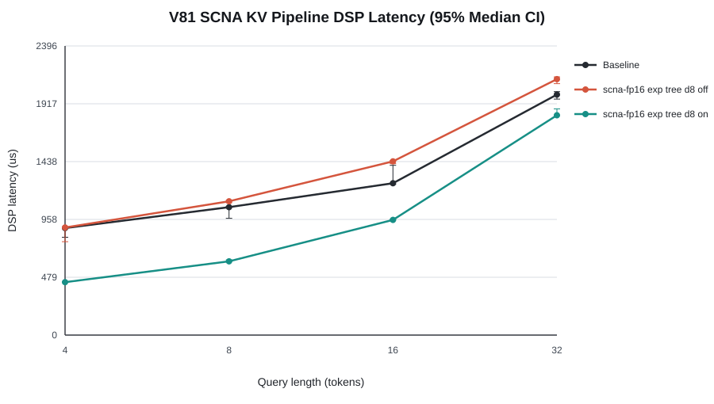

# SCNA on HVX：阶段五 KV DMA/VTCM 流水总结

> **一句话结论：** 两个 64-row VTCM staging buffer 将 2D DMA 与 HVX K/V layout transform 交错，并把 V 的首段 DMA 提前到 QK + safe-softmax 期间后，96 个 SCNA 配置全部获得统计显著的 DSP 加速；q32 median speedup 为 `1.194x`，FP16 exp tree d8 从 `2121.0 us` 降到 `1821.5 us`，相对同批现有 baseline 达 `1.094x`，且 pipeline on/off 为 0 byte mismatch。

## 1. 工作概况

| 任务 | 状态 | 量化结果 |
|---|---|---|
| 双 VTCM row buffer | 完成 | 2 × 64 rows × head-dim；head-dim 128 时仅增加 32 KiB VTCM |
| 2D DMA/HVX pipeline | 完成 | K/V 跨 KV-head stride 由 DMA gather 到连续 staging buffer |
| 跨阶段 overlap | 完成 | V 首段 DMA 与当前 QK + safe-softmax 重叠，不假设 HVX 与同步 HMX 调用并发 |
| profiling | 完成 | 独立记录 DMA issue、DMA wait、KV transform、K load、V load |
| byte-level regression | 完成 | 96 on/off compares，最大 byte mismatch 0 |
| FP32 correctness | 完成 | 96 compares，最大 RMSE `8.86e-4`，0 nonfinite |
| 主性能矩阵 | 完成 | 4 baseline + 96 off + 96 on；每组 5 warmup + 20 measured |

## 2. 问题定义与假设

阶段四已经把 SCNA d32 FP16 pair microkernel 加速到 `2.094x`，但 q32 最快 SCNA 仍比 baseline 慢 20.4%。profiling 显示除 SCNA compute 外，K/V 的 strided DDR load + tile transform 仍按阶段串行执行。阶段五检验：用固定大小 row staging buffer 能否隐藏 DMA 等待，又不因完整 KV tile ping-pong 增加数 MiB VTCM。

| 假设 | 可证伪判据 | 结果 |
|---|---|---|
| H1：pipeline 不改变算法语义 | on/off 必须逐字节一致 | 成立：96/96 gate pass，0 mismatch |
| H2：DMA 与 transform 能有效交错 | K+V median 至少下降 30%，DMA wait 小于 transform | 成立：选定 q32 配置下降 48.6%；wait 95 us < transform 192 us |
| H3：收益覆盖完整 Pareto | 96 个 function/precision/kernel/width/Qo 配置 speedup CI 均排除 1 | 成立：96/96，最小 CI 下界 `1.098x` |
| H4：优化后至少一个 SCNA 配置在所有 Qo 超过现有 baseline | 最快 on 配置 baseline speedup > 1 | 成立：q4/q8/q16/q32 为 `2.053x/1.734x/1.318x/1.094x` |

## 3. 实验设置

| 配置项 | 设置 |
|---|---|
| Device | SM8750P，ADB serial `bde3ddde`，model `25091RP04C` |
| DSP/build | Hexagon v81；SDK 6.6.0.0；最终 compile/link 含 `-mv81` |
| Main shape | `kv_len=4096`，heads/KV-heads `12/2`，head-dim 128，`qo_len={4,8,16,32}` |
| Matrix | exp2/exp × FP16/INT8 × direct/tree × d8/d16/d32 × pipeline off/on |
| Ordering | 每个 shape 先 off、紧接 on，降低温度/DVFS 的长时间漂移 |
| Repetition | 单 worker；5 warmup + 20 measured；所有 196 配置均有 20 samples |
| Statistics | median、p95、bootstrap median 95% CI、bootstrap median-ratio 95% CI |
| Correctness | full/padding/causal；`kv_len=4093/4096`；head-dim 64/128 |
| Baseline | 同批当前 FlashAttention baseline，未启用 KV pipeline |

最后一项必须明确：KV pipeline 是通用数据调度优化，不是 SCNA 函数逼近本身。与未流水 baseline 的比较回答“组合方案是否超过现有实现”；off/on 消融才回答“pipeline 自身贡献多少”。

## 4. 实现与同步边界

### 4.1 Pipeline 结构

1. 每个 staging buffer 容纳 64 行原始 K 或 V；通过 2D DMA 从 `[kv_len, n_kv_heads, head_dim]` 的 strided DDR layout gather 到连续 VTCM。
2. K load 中，DMA 写 next buffer 时，HVX 将 current buffer 转为 HMX 所需的 K tile layout。
3. K 完成后立即发出 V 首段 DMA；当前线程继续同步执行 QK HMX 与 safe-softmax，V DMA 独立前进。
4. V load 阶段先等待首段完成，再用同样的 ping-pong 方式交错后续 DMA 与 HVX layout transform。
5. 保留 next K/V `l2fetch`。HMX acquire/release 顺序和 online softmax 行归约顺序完全不变。

没有让 HVX 代码与同步 HMX API 假并发；实际 overlap 仅发生在 DMA engine 与当前 HMX/HVX 消费之间，以及 next DMA 与 current HVX transform 之间。

### 4.2 接口与观测

- `--scna-pipeline on|off`
- `--compare-pipeline`
- `FIG8_ATTENTION_TIMERS ... kv_dma_issue=... kv_dma_wait=... kv_transform=...`
- CSV、raw log、summary 均显式记录 pipeline phase；runner 支持完整日志判定、3 次重试和断点续跑。

## 5. 量化结果

### 5.1 端到端延迟

**Key Finding：** 对选定的 FP16 exp tree d8，pipeline speedup 随 Qo 从 `2.033x` 下降到 `1.164x`。固定 K/V 搬运成本在小 Qo 占比更高；Qo 增大后 SCNA compute 增长，而每个 KV tile 的 load savings 不同比例增长。

| Qo | Baseline DSP us | Pipeline off DSP us | Pipeline on DSP us | Speedup [95% CI] | Off/On K+V us | Host speedup |
|---:|---:|---:|---:|---:|---:|---:|
| 4 | 887.0 | 891.5 | 438.5 | 2.033x [1.763, 2.047] | 664.0 / 248.0 | 1.627x |
| 8 | 1060.5 | 1109.0 | 611.5 | 1.814x [1.772, 1.829] | 696.5 / 240.0 | 1.691x |
| 16 | 1258.5 | 1439.5 | 954.5 | 1.508x [1.488, 1.515] | 662.0 / 228.0 | 1.410x |
| 32 | 1993.0 | 2121.0 | 1821.5 | 1.164x [1.128, 1.175] | 590.5 / 303.5 | 1.145x |

### 5.2 全配置 speedup

**Key Finding：** q32 的 24 个 SCNA 配置全部加速，范围 `1.102x–1.233x`、median `1.194x`；扩展到四个 Qo 后，96/96 个 DSP ratio CI 下界大于 1，最小下界 `1.098x`。因此收益不是某个 width、precision 或函数的单点现象。

| q32 group | 最小 speedup | 最大 speedup | 机制观察 |
|---|---:|---:|---|
| FP16 exp2 | 1.102x | 1.225x | tree d8/d16 收益约 1.22x；direct d32 被 SCNA compute 稀释 |
| FP16 exp | 1.138x | 1.223x | tree/direct 均获益；tree d8 达 baseline 1.094x |
| INT8 exp2 | 1.182x | 1.208x | 四组较集中，pipeline 与整数 kernel 正交 |
| INT8 exp | 1.102x | 1.233x | direct d16 最大；tree d32 最小 |

### 5.3 时间归因

**Key Finding：** 选定 q32 配置的 DSP 总时延减少 299.5 us，其中 K+V 减少 287.0 us，占总降幅 95.8%；SCNA compute 为 `1076 -> 1079 us`，变化仅 0.3%。这直接证明收益来自数据调度，而不是 nonlinear kernel 或归约顺序改变。

| q32 FP16 exp tree d8 | Off (us) | On (us) | Delta |
|---|---:|---:|---:|
| DSP total | 2121.0 | 1821.5 | -299.5 |
| K load | 307.0 | 153.5 | -153.5 |
| V load | 283.5 | 150.0 | -133.5 |
| Safe-softmax | 1449.0 | 1437.5 | -11.5 |
| SCNA compute（safe-softmax 子集） | 1076.0 | 1079.0 | +3.0 |
| DMA issue / wait / KV transform | 0 / 0 / 0 | 9 / 95 / 192 | 新增观测 |

更宽的 direct SCNA 在 V DMA 发出后提供更长的 safe-softmax 覆盖窗口。例如 q32 FP16 exp direct d32 的 DMA wait 仅 18 us，而 tree d8 为 95 us；这不是 d32 搬运更快，而是更多 DMA 时间被其更长的 SCNA compute 隐藏。

### 5.4 正确性

| Gate | 数量 | 最坏结果 | Failure |
|---|---:|---:|---:|
| Pipeline on/off byte compare | 96 | 0 byte mismatch | 0 |
| Pipeline output vs host FP32 | 96 | RMSE `8.86e-4`，max abs `2.91e-3` | 0 |
| Mask/tail numeric probes | 192 | 所有 required-zero tail 为 0 | 0 |
| 选定 FP16 exp tree d8 vs FP32 | 4 | max RMSE `6.94e-4`，max abs `1.37e-3` | 0 |

**Key Finding：** DMA gather 与 direct DDR load 生成完全相同的 K/V tile bytes，行归约、P store 与 HMX 消费顺序未变；因此所有精度、mask、tail 和 head-dim case 均达到字节级 pipeline 等价。

## 6. 异常分析与反思

### 6.1 Unexpected Results

- **小 Qo 加速超过 2x：** q4 的 K+V 在 off 路径占比极高，2D DMA 同时消除了 strided DDR vector load 的大部分代价，并与 transform 交错，因此收益不只是“隐藏一点等待”。
- **DMA wait 随 SCNA width 下降：** 这是 V 首段 DMA 与 safe-softmax overlap 的结果；不能据此声称 d32 DMA engine 更快。
- **baseline session 漂移：** 本批 baseline q32 为 1993 us，阶段四为 1917 us，相差 4.0%。主 pipeline 因果结论使用相邻 off/on 配置，跨阶段绝对值只作历史参考。

### 6.2 Limitations

- 现有 baseline 未启用同一 KV pipeline，所以 `1.094x baseline speedup` 是“组合方案 vs 当前实现”，不能归因给 SCNA 数学本身。
- 2D DMA 目前 `src_bypass=1`，保留的 next-tile `l2fetch` 对 DMA path 的贡献尚未单独消融。
- 本阶段使用单 worker；DMA engine 在多 worker 下可能串行化或竞争，不能外推 scalability。
- synthetic input 与 FP32 gate 不替代模型级 perplexity。

## 7. 下一阶段行动

1. 冻结 SCNA 实验代码、raw data 与阶段报告，形成独立提交。
2. 将 baseline+pipeline 作为附加调度消融，区分通用 KV 调度上限与 SCNA nonlinear 成本；不改写本阶段主结论。
3. 转入独立 `flashattention-heteroinfer-cpu-v81` 仓库，只修改 CPU stub、request channel 与等待策略，不带入 SCNA 或 DSP KV pipeline。
4. CPU 实验用完全相同 baseline kernel hash，测 legacy/spin/predictive、CPU affinity、host control overhead 与 Amdahl 上限。

## 8. 数据与代码索引

- 主矩阵：`results/v81/scna/stage5-pipeline-main-20260801/`
- 正确性：`results/v81/scna/stage5-pipeline-correctness-20260801/`
- pipeline runner：`scripts/run_scna_v81_pipeline.sh`
- correctness runner：`scripts/run_scna_v81_pipeline_correctness.sh`
- analysis：`scripts/analyze_scna_pipeline.py`
- DSP implementation：`src/htp-ops-lib-main/src/dsp/ops/flash_attn.c`

## 9. Checklist

- [x] 所有图包含标题、坐标轴、单位、图例；speedup 与 latency 图包含 95% CI。
- [x] 同批 baseline、pipeline off 与 pipeline on 均有对比。
- [x] 每张图后有量化 Key Finding。
- [x] 正确区分 SCNA compute 与通用 KV 调度贡献。
- [x] 记录异常、混杂因素、限制和下一阶段可执行动作。
