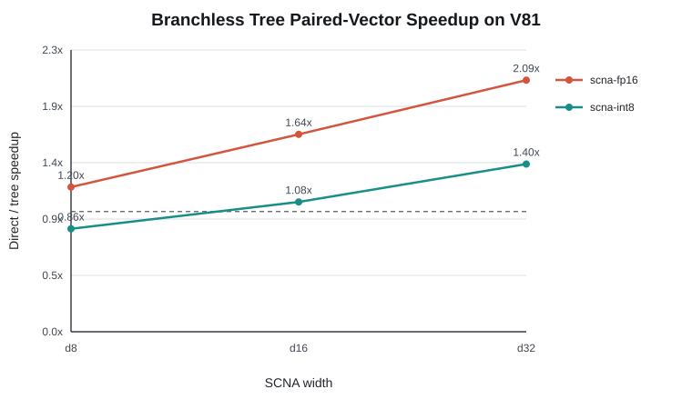
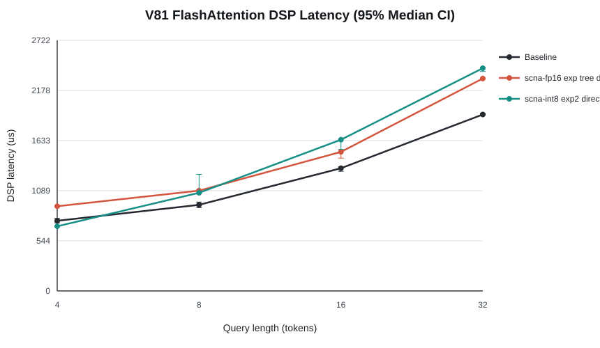

# SCNA on HVX：阶段四 Branchless Tree 重写与正确性闭环

> **一句话结论：** 将 O(d) affine/ReLU neuron-sum 改写为 O(log d) 的寄存器索引 breakpoint tree 后，FP16 d32 pair microkernel 加速 `2.094x`，最终 v81 指令数减少 `3.51x`；但端到端 `qo_len=32` 最快 SCNA 仍比 baseline 慢 `20.4%`，因为 SCNA 仍占 DSP 总时延 `49.1%`，假设“仅靠 tree 即可全面超过 baseline”被数据否定。

## 1. 工作概况

| 任务 | 状态 | 量化结果 |
|---|---|---|
| exp2/exp 参数训练与导出 | 完成 | 2 functions × FP16/INT8 × d8/d16/d32；checkpoint、metadata、header 可追溯 |
| direct kernel 保留 | 完成 | 作为同参数、同行归约顺序的性能与数值 baseline |
| branchless tree kernel | 完成 | 固定 4/5/6 层；最终 binary 含 24 个 single/pair 特化 kernel |
| v81 静态资源检查 | 完成 | d32 pair 指令减少：FP16 `586 -> 167`，INT8 `476 -> 202` |
| Attention 正确性闭环 | 完成 | 100 FP32 对照、48 direct/tree 对照、100 mask/tail probes，0 gate failure |
| v81 主性能矩阵 | 完成 | 100 Attention 配置；每组 5 warmup + 20 measured |
| 下一阶段 | 进行中 | KV row-buffer pipeline 与 pipeline on/off 一致性、收益测量 |

## 2. 问题定义与假设

阶段三的 direct kernel 对每个 64-lane vector 串行执行 d 次 affine、ReLU 和累加，复杂度随 width 线性增长。SCNA 导出的函数是凸分段线性函数，因此同一函数也可表示为：先通过平衡树找到输入所在区间，再只执行该区间的一次 `slope*x+bias`。

| 假设 | 可证伪判据 | 结果 |
|---|---|---|
| H1：tree 将串行计算从 O(d) 降到 O(log d) | d32 指令数与 pair latency 至少降低 40% | 成立：FP16 指令降 71.5%，pair latency 降 52.2% |
| H2：tree 与 direct 保持数值等价 | INT8 字节一致；FP16 RMSE <= 0.002、max abs <= 0.01 | 成立：INT8 0 mismatch；FP16 最大 RMSE `1.50e-5` |
| H3：tree 收益可传递到 Attention | q32 tree 比同配置 direct 快 | 大部分成立：FP16 d16/d32 为 `1.15x-1.54x`；INT8 d32 为 `1.12x-1.19x` |
| H4：SCNA 可全面超过现有 baseline | 四个 Qo 的最佳 SCNA DSP median 均低于 baseline | 不成立：仅 q4/q8 出现 `1.085x/1.050x`，q16/q32 为 `0.989x/0.831x` |

## 3. 实验设置

| 配置项 | 设置 |
|---|---|
| Device | SM8750P，ADB serial `bde3ddde`，model `25091RP04C` |
| DSP | Hexagon v81；SDK 6.6.0.0、Hexagon Tools 19.0.07 |
| Build gate | 最终 `build.ninja` compile/link flags 均含 `-mv81`，HVX length 128B |
| 主 case | `kv_len=4096`，heads/KV-heads `12/2`，head-dim 128，`qo_len={4,8,16,32}` |
| Attention repetition | 单 worker；5 warmup + 20 measured |
| Micro repetition | 每次 100,000 iterations，共 10 次独立 repetition |
| Correctness cases | full/padding/causal，`kv_len=4093/4096`，head-dim 64/128 |
| Statistics | median、p50、p95、deterministic bootstrap median 95% CI |
| 主对比 | baseline vs SCNA；LUT 不进入本阶段主数据与图 |

注意：Attention 配置按固定顺序执行，bootstrap CI 反映组内抖动，不消除温度、DVFS 与执行顺序混杂；因此小于约 5% 的跨配置差异需要随机交错复测后才能形成强结论。

## 4. 实现与归因

### 4.1 做了什么

1. 同时支持 `exp2` 与 `exp`。`exp2` 的 score scale 为 `log2(e)/sqrt(d)`，`exp` 为 `1/sqrt(d)`；P-tile 与 running-max 使用同一函数。
2. 保留 direct neuron-sum，并新增 d8/d16/d32 编译期固定深度的 branchless tree。
3. tree 用 `vlut16` 在 HVX 寄存器内按 lane 选择 threshold/slope/bias；这是树节点索引指令，不是 LUT 指数近似 backend。
4. FP16 tree 使用 FP16 参数。INT8 tree 使用 S8 输入、S16 参数和 S32 中间乘加，再按正确 lane 顺序 pack 到 S16/FP16。
5. 被 mask 或 tail 的 lane 先映射到有限下界，SCNA 后再显式置零；`-inf` 不送入网络。
6. 新增 `--scna-function`、`--scna-kernel`、通用 `--scna-exp-bench` 与 `--compare-direct-tree`。
7. runner 新增完整日志判定、3 次重试和断点续跑。本轮捕获并恢复 1 次本地 `adb shell` 挂起，失败尝试单独保存在 `retries/`。

### 4.2 Microkernel：tree 的收益随 width 增大

**Key Finding：** FP16 tree 在 d8/d16/d32 分别加速 `1.204x/1.643x/2.094x`，符合 O(log d) 替代 O(d) 的假设；INT8 d8 反而为 `0.857x`，说明量化和 S32 pack 的固定成本在窄网络中超过减少的 multiply 成本。

| Precision | Width | Direct pair (us/100k) | Tree pair (us/100k) | Direct/Tree |
|---|---:|---:|---:|---:|
| FP16 | 8 | 5466 | 4538 | 1.204x |
| FP16 | 16 | 9489 | 5776 | 1.643x |
| FP16 | 32 | 18358 | 8767 | 2.094x |
| INT8 | 8 | 5570 | 6498 | 0.857x |
| INT8 | 16 | 8354 | 7735 | 1.080x |
| INT8 | 32 | 13820 | 9901 | 1.396x |

### 4.3 v81 packetized assembly：multiply 压力被 lookup 取代

| Precision | Width | Direct/Tree code size | Direct/Tree instructions | Direct/Tree multiply | Tree `vlut16` | Tree inst./packet |
|---|---:|---:|---:|---:|---:|---:|
| FP16 | d8 | 612 / 364 B | 153 / 91 | 24 / 4 | 11 | 2.53 |
| FP16 | d16 | 1196 / 456 B | 299 / 114 | 48 / 4 | 19 | 2.33 |
| FP16 | d32 | 2344 / 668 B | 586 / 167 | 96 / 4 | 35 | 2.39 |
| INT8 | d8 | 656 / 544 B | 164 / 136 | 10 / 4 | 11 | 2.39 |
| INT8 | d16 | 1072 / 632 B | 268 / 158 | 18 / 4 | 19 | 2.29 |
| INT8 | d32 | 1904 / 808 B | 476 / 202 | 34 / 4 | 35 | 2.27 |

**Key Finding：** d32 FP16 pair 的 multiply 从 96 降到 4、指令从 586 降到 167，与实测 `2.094x` 加速方向一致；tree 仍需要 35 次 lookup，且 packet 填充约 2.3 instructions/packet，所以静态 `3.51x` 指令缩减没有等比例变成 runtime speedup。

### 4.4 端到端 Attention：存在两个小 Qo 赢点，但大 Qo 仍失败

**Key Finding：** 最快 SCNA 在 q4/q8 分别获得 `1.085x/1.050x` DSP speedup；q16 与 baseline 基本持平，q32 最快配置仍慢 20.4%。随着 query length 增大，SCNA 调用次数线性增加，非线性阶段重新成为主导成本。

| Qo | Baseline DSP median [95% CI] (us) | 最快 SCNA | SCNA DSP median [95% CI] (us) | Baseline/SCNA |
|---:|---:|---|---:|---:|
| 4 | 762.5 [740.0, 788.0] | INT8 exp2 direct d8 | 702.5 [701.0, 703.0] | 1.085x |
| 8 | 935.0 [905.0, 965.5] | FP16 exp2 tree d8 | 890.5 [889.0, 892.0] | 1.050x |
| 16 | 1333.0 [1299.5, 1348.0] | FP16 exp2 direct d8 | 1347.5 [1342.5, 1352.5] | 0.989x |
| 32 | 1917.0 [1909.5, 1929.5] | FP16 exp tree d8 | 2308.0 [2304.0, 2313.0] | 0.831x |

在 q32，FP16 tree 相对 direct 的 d8/d16/d32 speedup 为 `1.02x/1.19x/1.54x`；INT8 为 `0.98x/1.01x/1.19x`。这说明 microkernel 收益确实进入 Attention，但外围 row decode、mask、归约、P store 和 HMX 阶段稀释了收益。

### 4.5 精度-性能 Pareto 与正确性门禁

**Key Finding：** width 增大持续降低函数逼近误差，但增加延迟；没有单一配置同时支配所有点。FP16 exp2 tree d32 的 dense RMSE 为 `5.64e-4`，q32 DSP median 为 2674.5 us；FP16 exp tree d8 的 dense RMSE 为 `1.648e-2`，但以 2308.0 us 成为 q32 最快 SCNA。

| Correctness gate | 样本数 | 最坏结果 | Failure |
|---|---:|---:|---:|
| DSP output vs host FP32 | 100 | SCNA max RMSE `8.86e-4`；0 nonfinite | 0 |
| FP16 direct vs tree | 24 | RMSE `1.50e-5`；max abs `7.63e-5` | 0 |
| INT8 direct vs tree | 24 | 0 byte mismatch | 0 |
| mask/tail probes | 100 | padding tail `p_last=0`；0 nonfinite | 0 |

现有 baseline 对 host FP32 的最坏 RMSE 为 `1.378e-3`，高于本轮 FP16 SCNA 的 `7.07e-4`。因此 SCNA 在这些随机输入上并非仅以精度换性能；但该结果不是模型级 perplexity 结论。

## 5. 异常分析与反思

### 5.1 被否决的第一版 tree

第一版虽称为 tree，但先用 O(d) splat/mux 展开全部区间，FP16 d32 pair 为 4073 us/10k，较 direct 1835 us/10k 慢 `2.22x`。INT8 同时出现 S32 pack lane 乱序，direct/tree max diff 达 `0.86`、单调性违例 2–3 次。该版本完整原始日志保留在 `stage4-tree-rewrite-20260801/`，未进入最终图。

修复分两步：

1. 用 `Q6_W_vshuff_VVR(hi, lo, -4)` 恢复 S32 lane 顺序，设备 probe 从 mismatch 降为 0。
2. 将参数预排为 `[0,32,1,33,...]`，按 lane 维护 node index，固定 4/5/6 层动态选择 threshold，最终只 lookup 一组 slope/bias。

### 5.2 为什么端到端仍低效

- q32 最快 SCNA 的 nonlinear 子阶段仍占 DSP total `49.1%`；高精度 d32 配置达到约 `60%–71%`。
- tree 把 multiply 压力转换为 lookup、compare/mux 和 lane-index 更新，无法达到 direct 指令缩减比例对应的加速。
- 每两行、每 64-column block 都有输入减 max、valid mask、P tile shuffle/store 与 FP32 row reduction；这些外围操作不随 tree width 减少。
- K/V load 和 HMX 同步边界仍按 tile 串行，当前只有 L2 prefetch，尚未量化 DMA wait 可隐藏比例。

### 5.3 Limitations

- 主结果为 synthetic deterministic input，不等价于 LLaMA/OPT WikiText-2 perplexity。
- INT8 输入饱和域为 `[-16,0]`；`[-256,-16)` 输出为 0，符合 FP16 softmax 下溢语义，但需模型级复核。
- q4/q8 的小幅胜出尚未用随机化配置顺序与跨温度 session 复现。
- 当前只报告单 worker；多 worker 不与主结论混合。

## 6. 下一阶段：KV Pipeline

1. 新增 `--scna-pipeline on|off` 与 `--compare-pipeline`，保证同输入、同参数、同行归约顺序。
2. 用两个 64-row VTCM staging buffers 交替执行 2D DMA 与 HVX K/V layout transform，避免复制完整 KV tile 导致 VTCM 爆炸。
3. 在当前 safe-softmax/HMX 消费前发出 next K/V `l2fetch`，不假设同步 HMX 与 HVX 可并发。
4. 独立记录 DMA issue、DMA wait、KV transform；pipeline on/off 输出要求字节一致。
5. 先用 q4/q32 做 correctness 与收益 gate；若 load 降低不足以抵消固定开销，则停止扩大矩阵并报告失败原因。

## 7. 数据与代码索引

- 主性能数据：`results/v81/scna/stage4-main-20260801/`
- 正确性矩阵：`results/v81/scna/stage4-correctness-20260801/`
- 10-repeat microbench：`results/v81/scna/stage4-vlut-tree-20260801/`
- 被否决 tree：`results/v81/scna/stage4-tree-rewrite-20260801/`
- packetized disassembly：`results/v81/scna/stage4-main-20260801/assembly/`
- SCNA kernel：`src/htp-ops-lib-main/src/dsp/ops/scna_exp2.c`
- Attention integration：`src/htp-ops-lib-main/src/dsp/ops/flash_attn.c`
- training/export：`training/fit_export_scna.py`

## 8. Checklist

- [x] 所有结论包含 baseline 与量化数值。
- [x] SVG 含标题、坐标轴、单位、误差区间和图例。
- [x] 每张图后均给出 Key Finding。
- [x] 明确记录失败假设、错误版本和根因。
- [x] 主结论不混入 LUT。
- [x] 下一阶段动作可执行、可验证、可停止。
